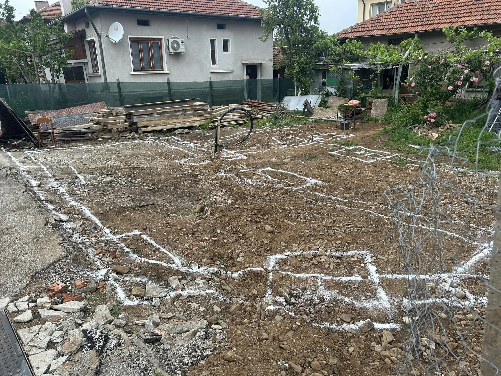
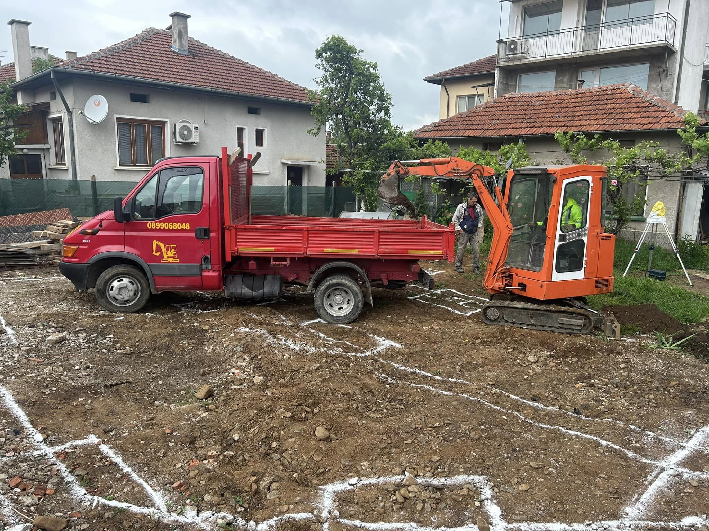
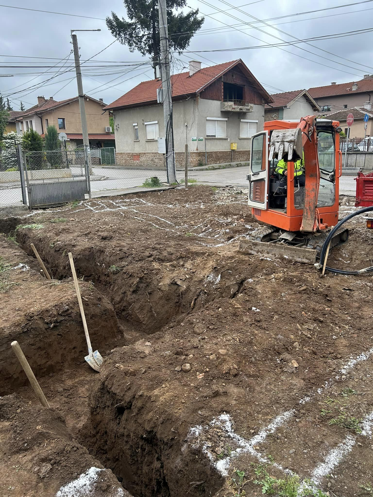
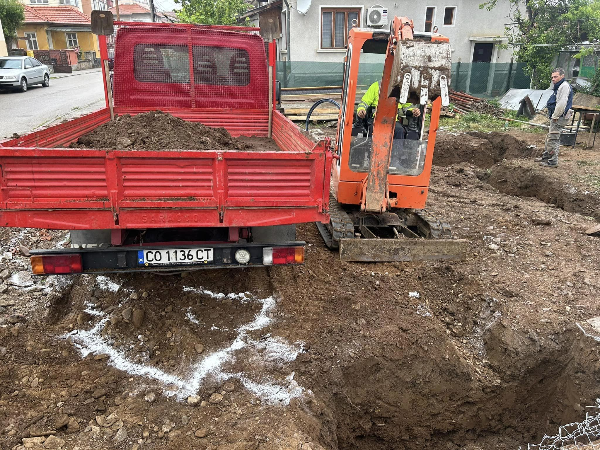
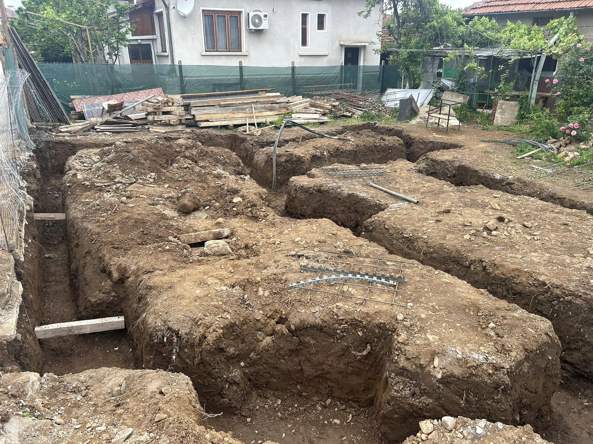
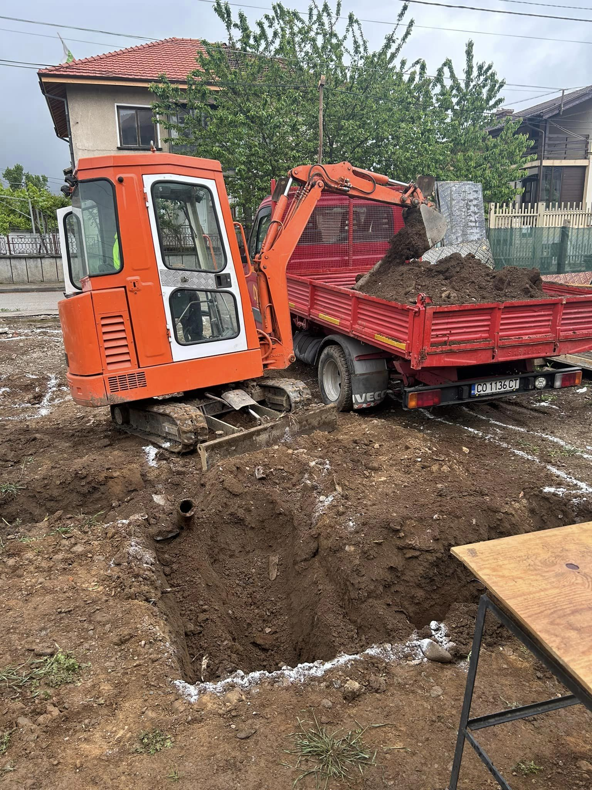
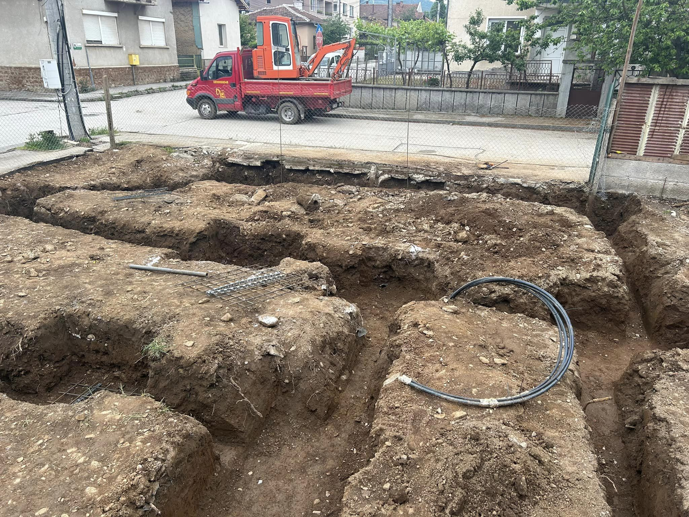
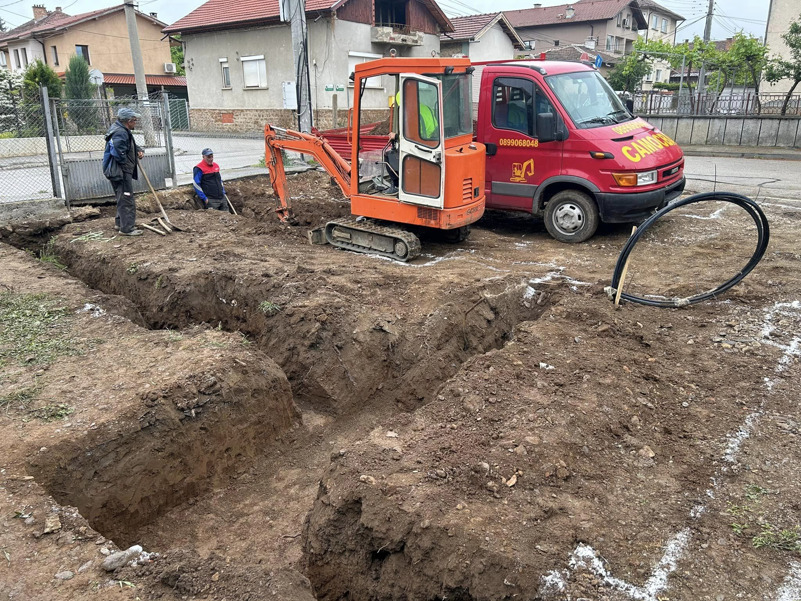
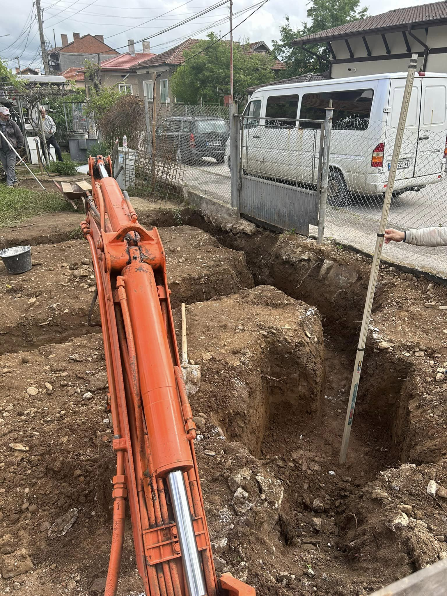
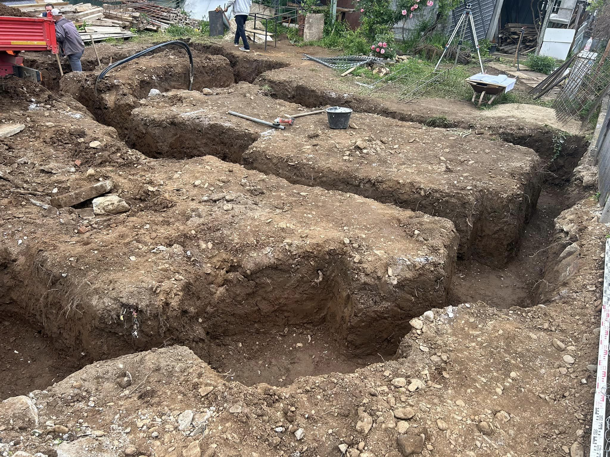

Изкопът за основите на къща е ключов етап в строителния процес, който осигурява стабилността и дълготрайността на вашия дом. Ние предлагаме професионални услуги за изкопаване на основи, които са съобразени с архитектурните и инженерните изисквания за безопасност.

## Какво включва услугата:

- Точно изчисляване и изкопаване на основи според проекта на къщата 🏡
- Осигуряване на подходящ терен за изграждане на стабилна основа 🏗️
- Премахване и извозване на излишната почва, осигурявайки чистота на строителната площадка 🚛

Нашият екип от квалифицирани специалисти разполага с модерна техника, която гарантира бързо и качествено изпълнение, за да осигурим стабилна и надеждна основа за вашия дом.

📞 Свържете се с нас за консултация и оферта още днес!

# Галерия от проект (Май, 2024):

