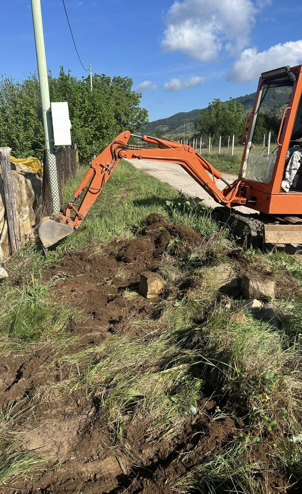
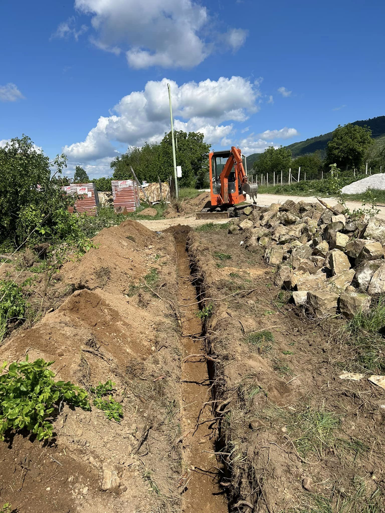
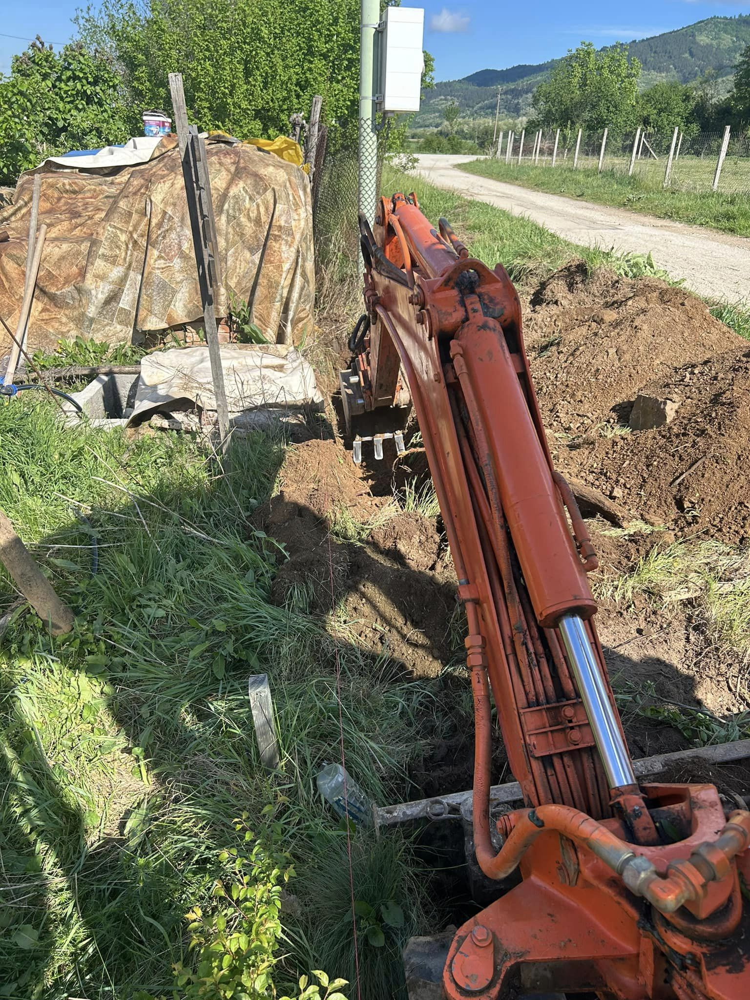
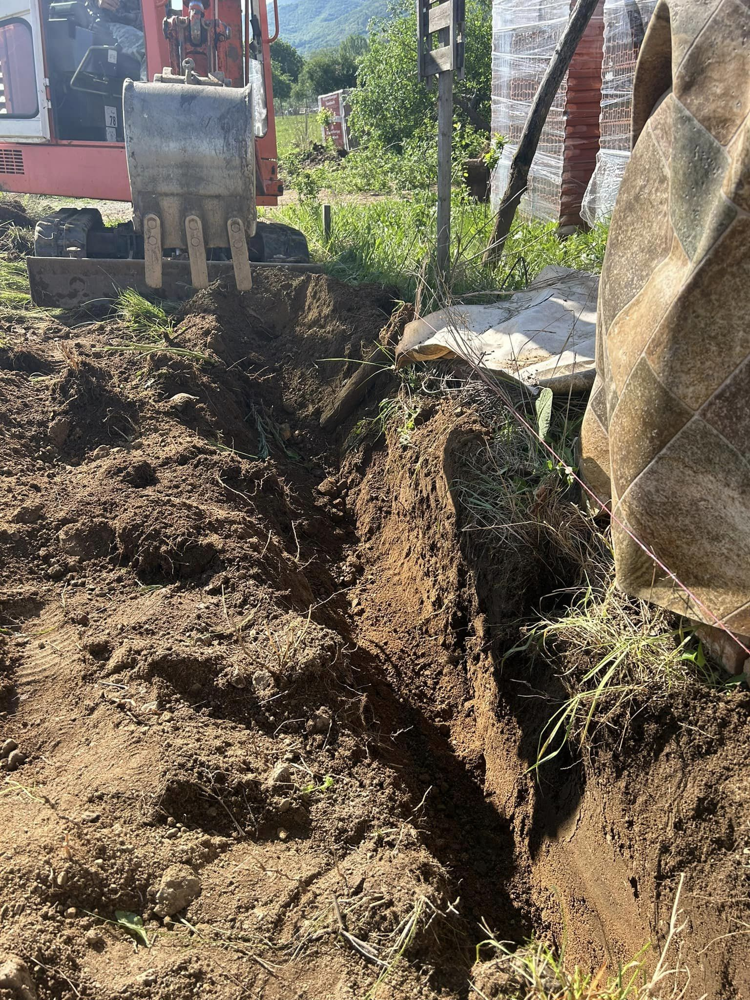
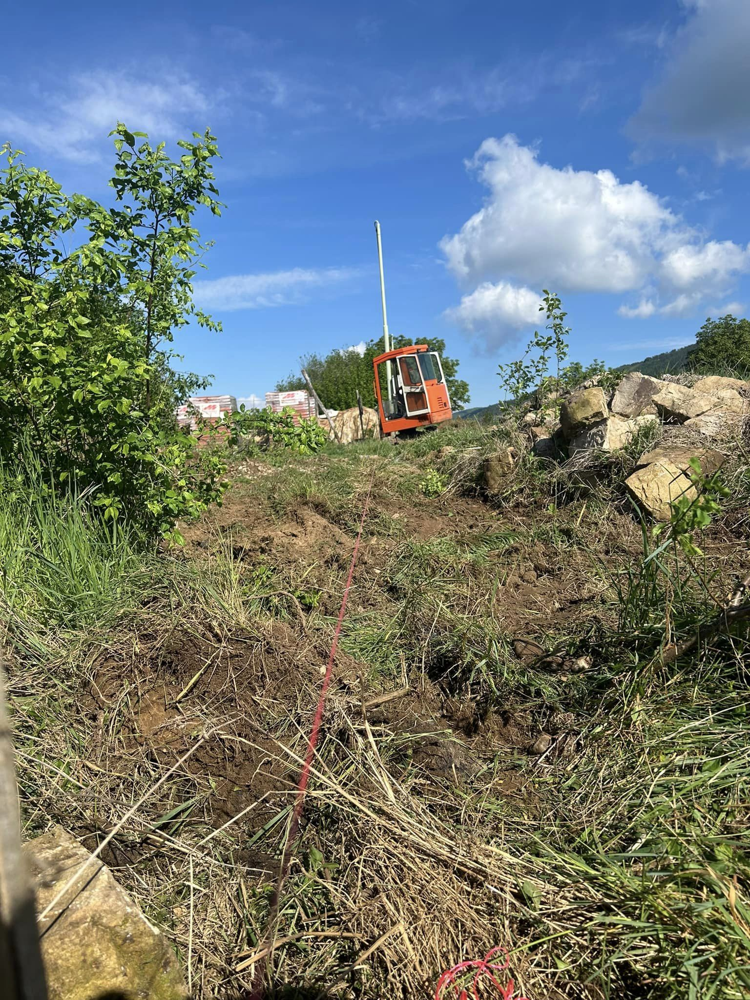
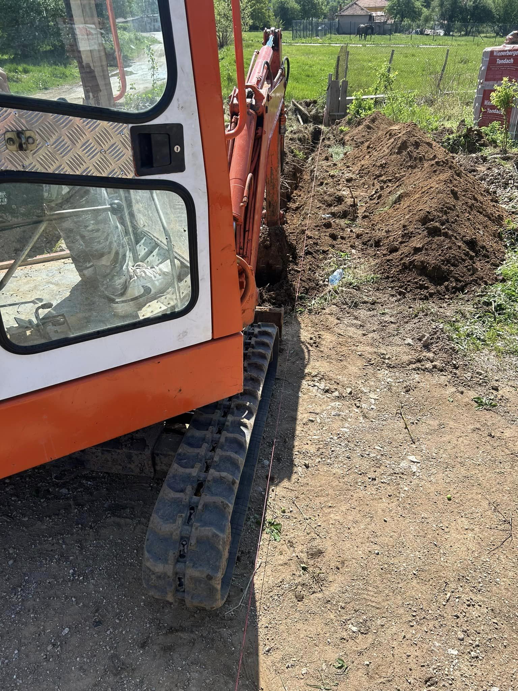
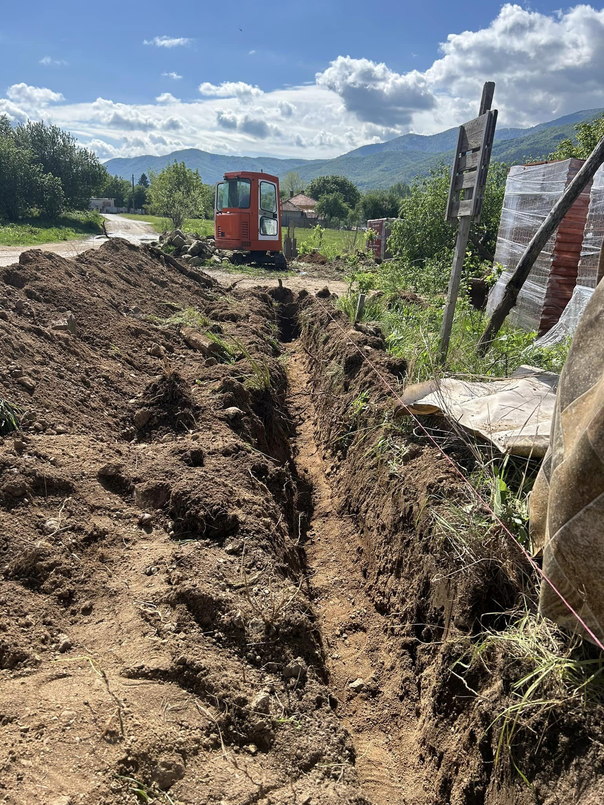

Изкопът за основите на ограда е от съществено значение за изграждането на здрави и дълготрайни конструкции, които да осигурят сигурност и естетика на вашия имот. Ние предлагаме професионални услуги за изкопаване на основи, които гарантират стабилност и безопасност на вашата ограда.

## Какво включва услугата:

- Прецизно изкопаване на основи според типа и височината на оградата 📏
- Подготовка на терена за правилно поставяне на основите и конструкцията 🏗️
- Извозване на излишните земни маси и почистване на работната зона 🚛

С нашия екип от опитни специалисти и модерна техника ще получите качествено и бързо изпълнение на услугата, осигурявайки здравина и устойчивост на вашата ограда.

📞 Свържете се с нас за оферта още днес!

# Галерия от проект (Април, 2024):

