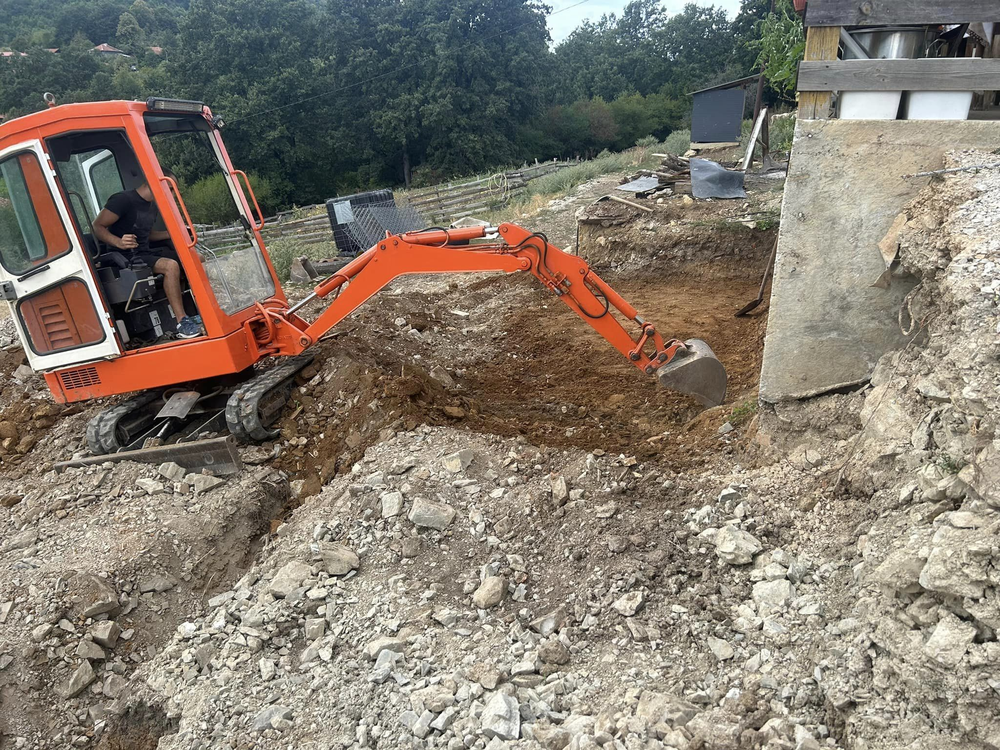
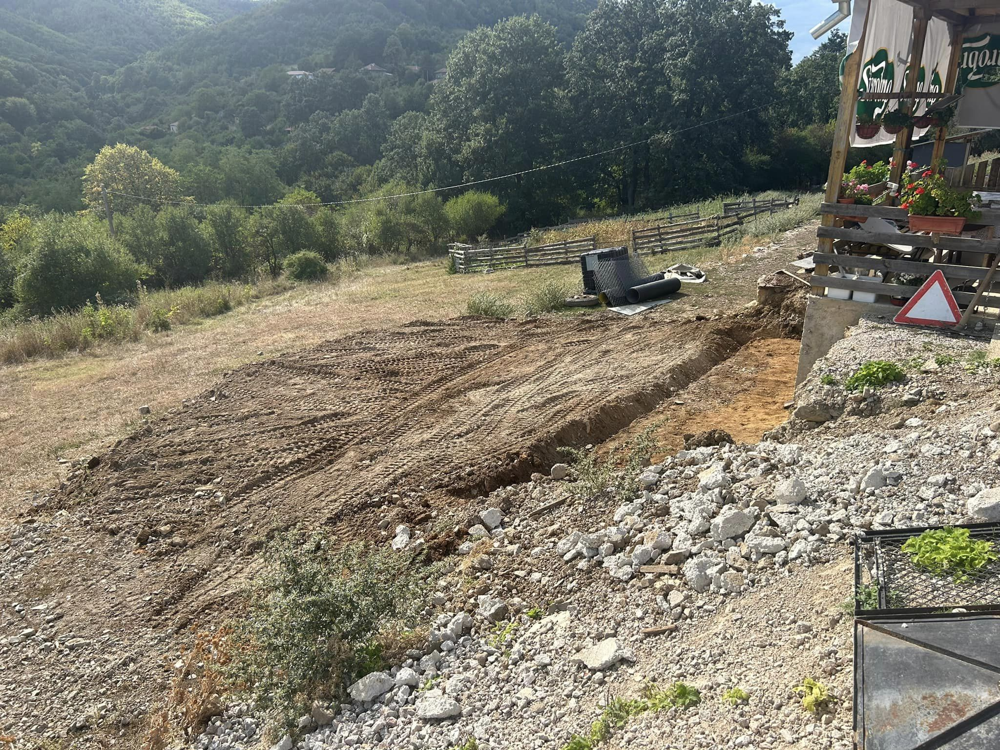
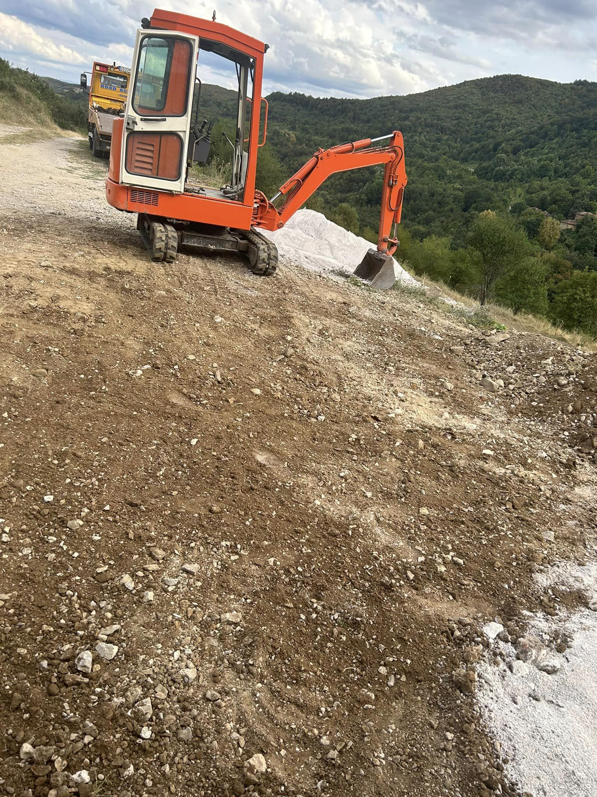
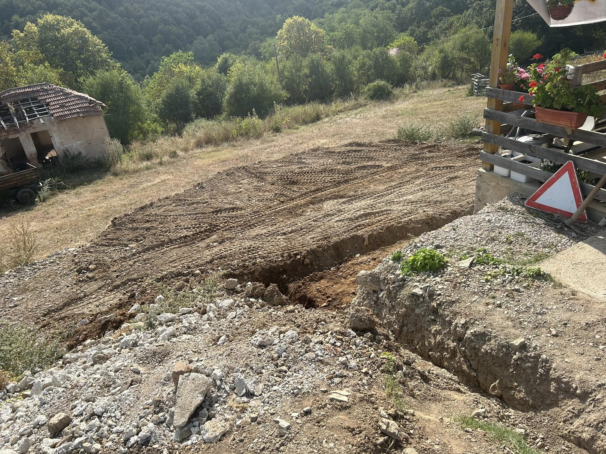
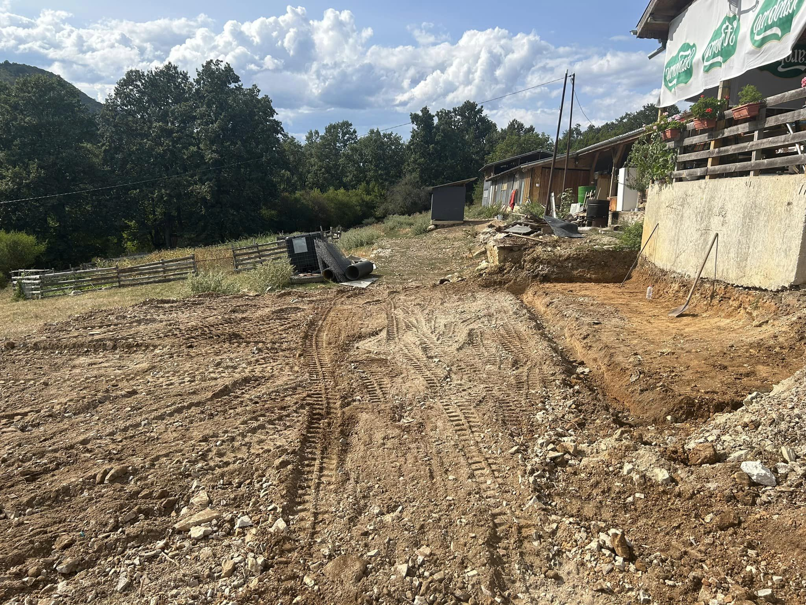
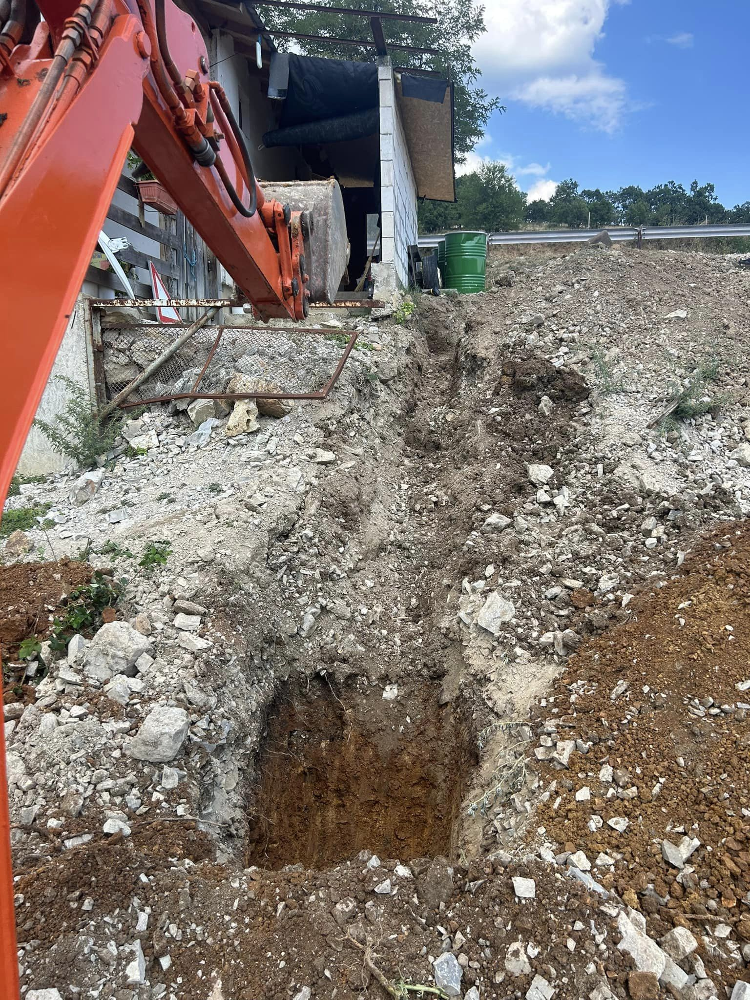
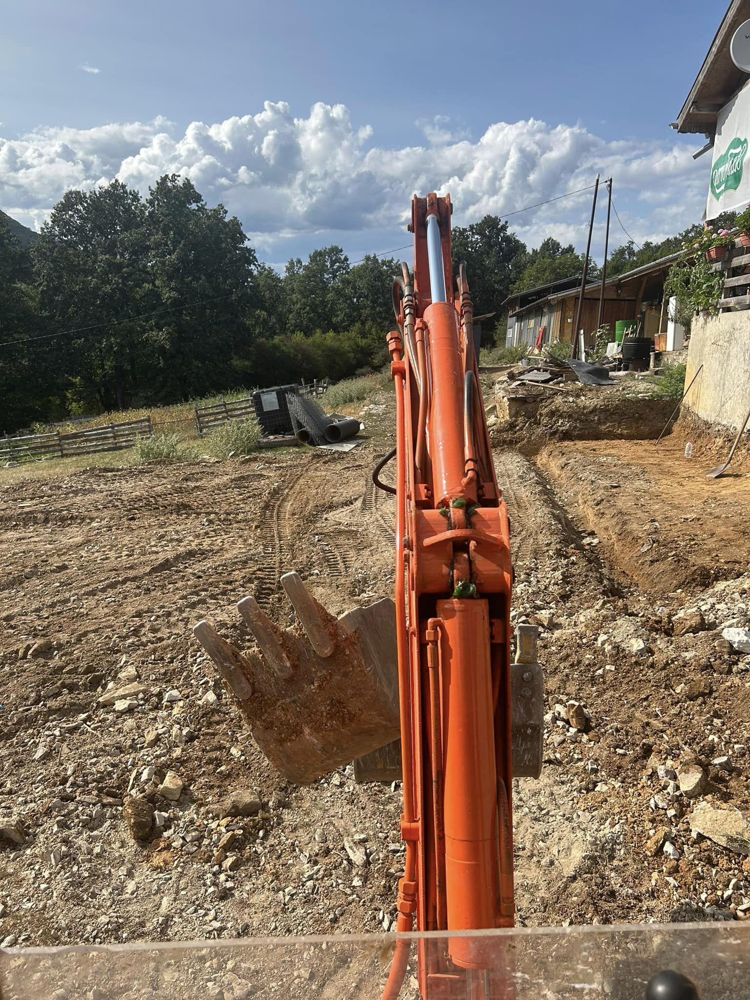
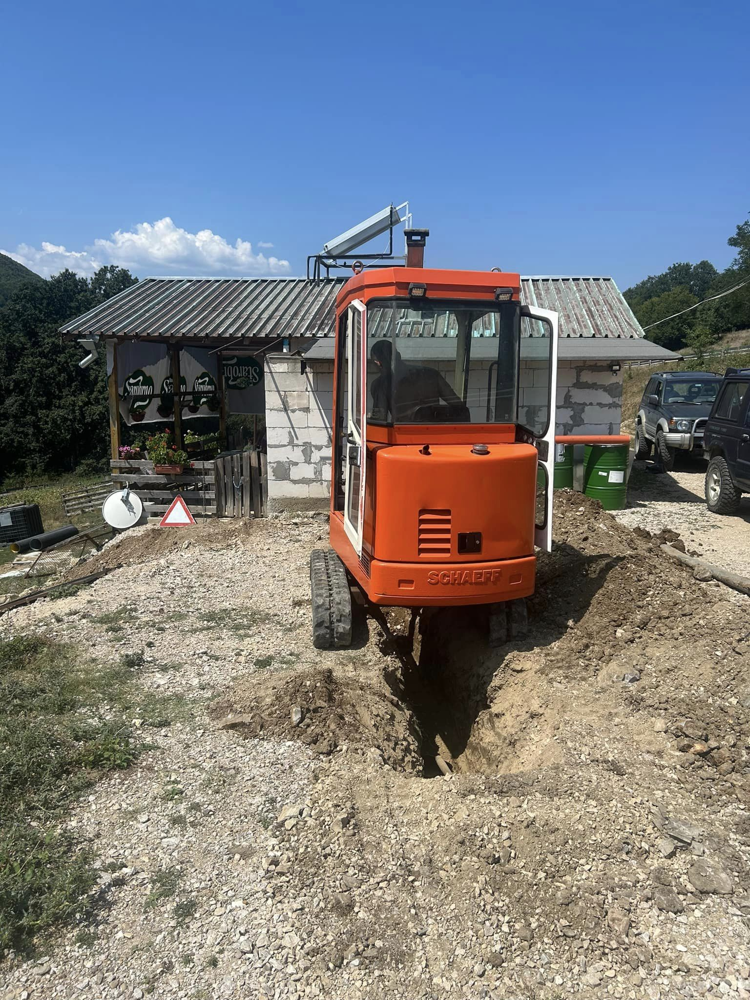
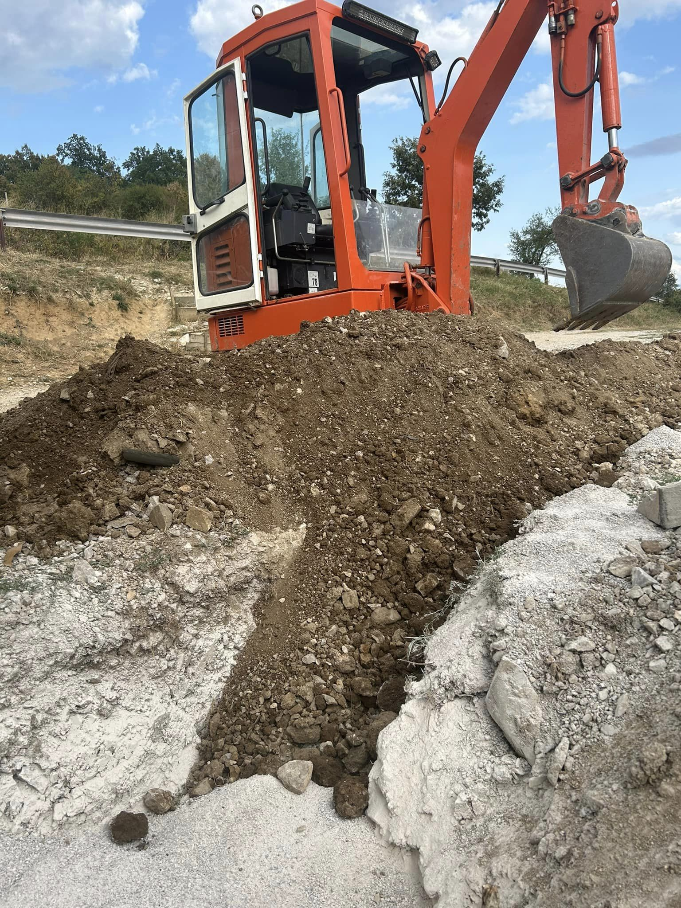

Изкопните дейности за основи на тераса и мазе изискват прецизност и внимание към детайла, за да се осигури стабилна основа за дълготрайна и безопасна конструкция. Ние предлагаме професионални услуги с багер за изкопаване на основи, съобразени с всички строителни стандарти.

## Какво включва услугата:

- Изкопаване на основи с точна дълбочина и форма според проекта 📐
- Премахване на излишни земни маси и подготовка на терена 🚜
- Гарантиране на стабилна основа за изграждане на тераса и мазе 🏗️

Нашите специалисти използват модерна техника, за да осигурят бързо и качествено изпълнение на вашия проект, осигурявайки солидна основа за бъдещите строителни дейности.

📞 **Свържете се с нас за оферта още днес!**

# Галерия от проект (Август, 2023):

