Изкопът за основи е ключов етап в строителството на всяка сграда, осигуряващ стабилна и сигурна база за бъдещите конструкции. Ние предлагаме професионални услуги за изкопни работи, които гарантират надеждността и дълготрайността на вашата постройка.

## Какво включва услугата

- Точно и прецизно изкопаване на основи според проектните изисквания 📐
- Осигуряване на подходяща дълбочина и ширина за безопасността и устойчивостта на конструкцията 🏗️
- Извозване и правилно депониране на излишните земни маси 🚛

С екип от опитни професионалисти и съвременна техника, ние осигуряваме бързо и качествено изпълнение на вашия проект, оставяйки ви стабилна основа за бъдещото строителство.

📞 Свържете се с нас днес за повече информация и безплатна консултация!

# Галерия от проект (Юли, 2024):

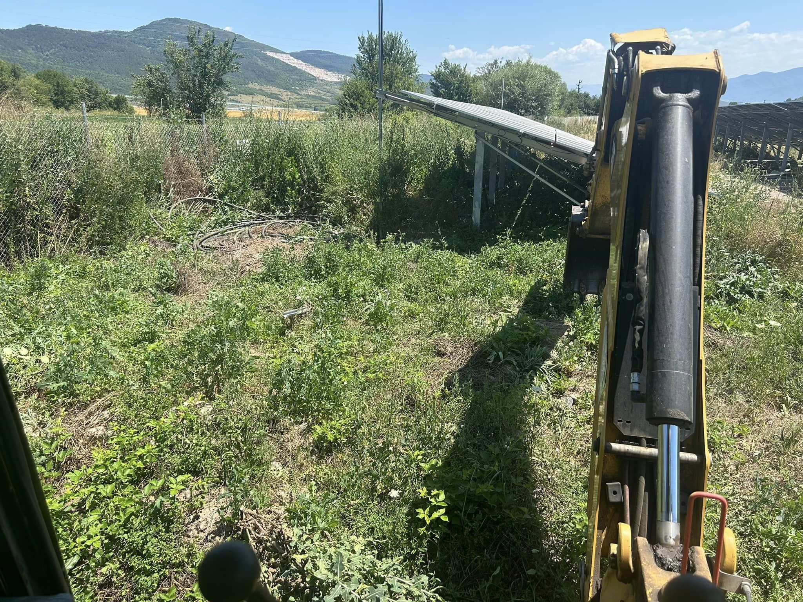
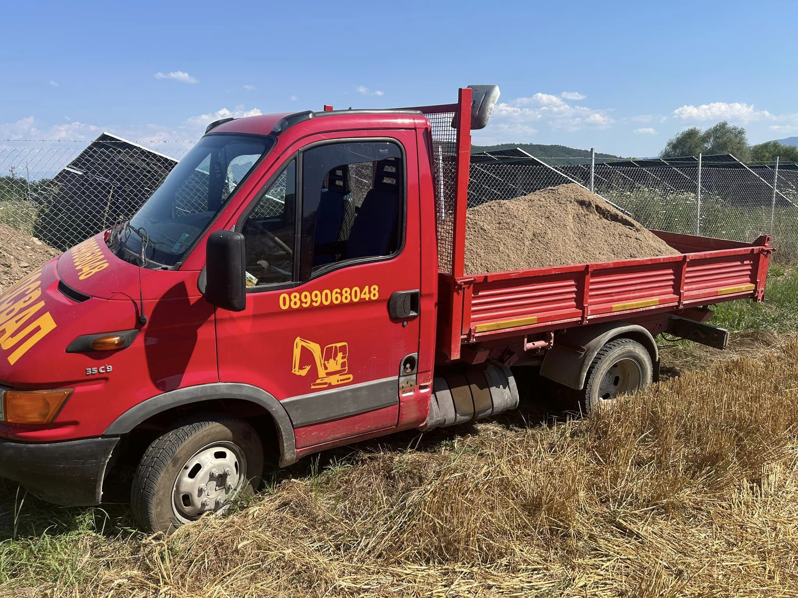
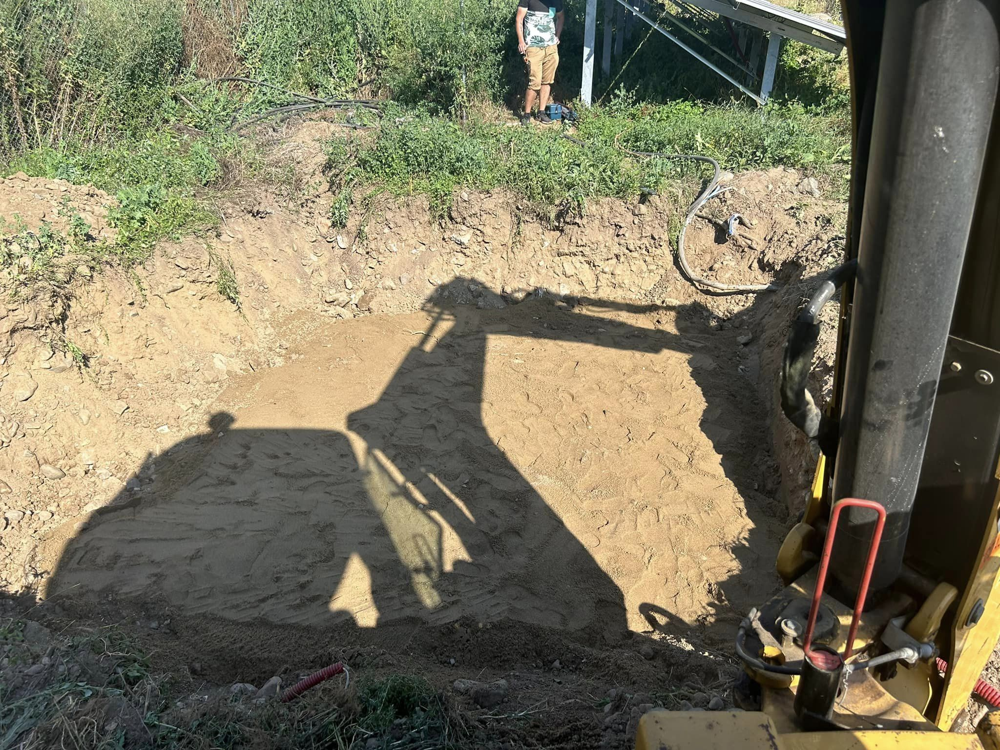
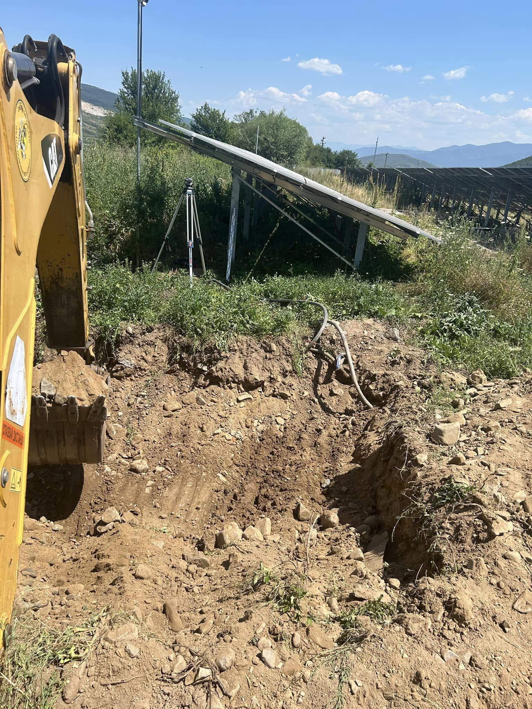
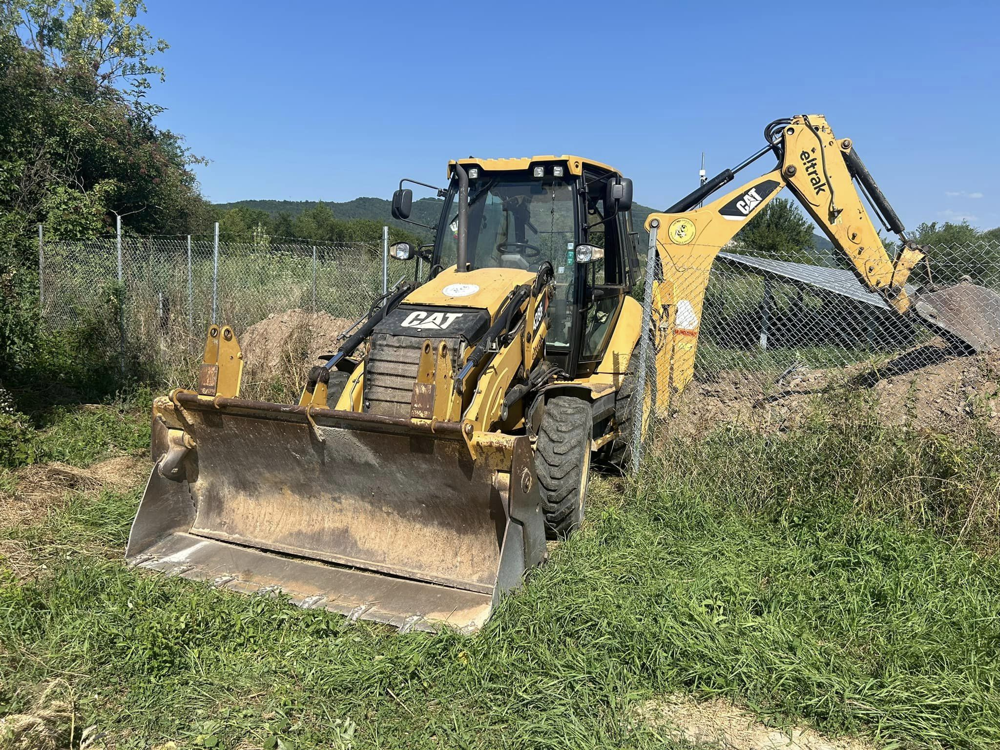

# Галерия от проект (Юни, 2024):

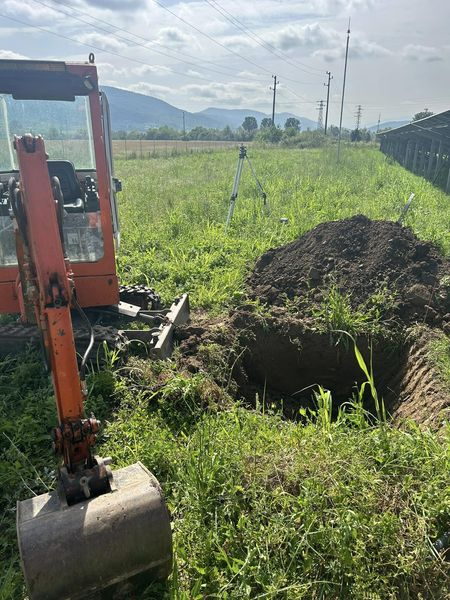
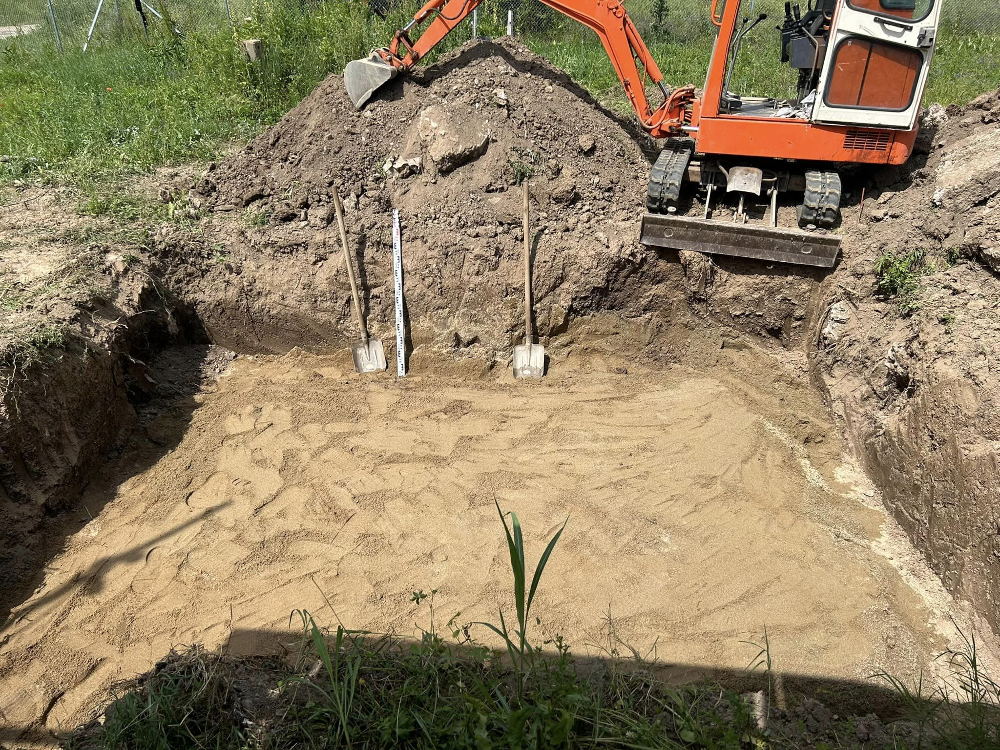
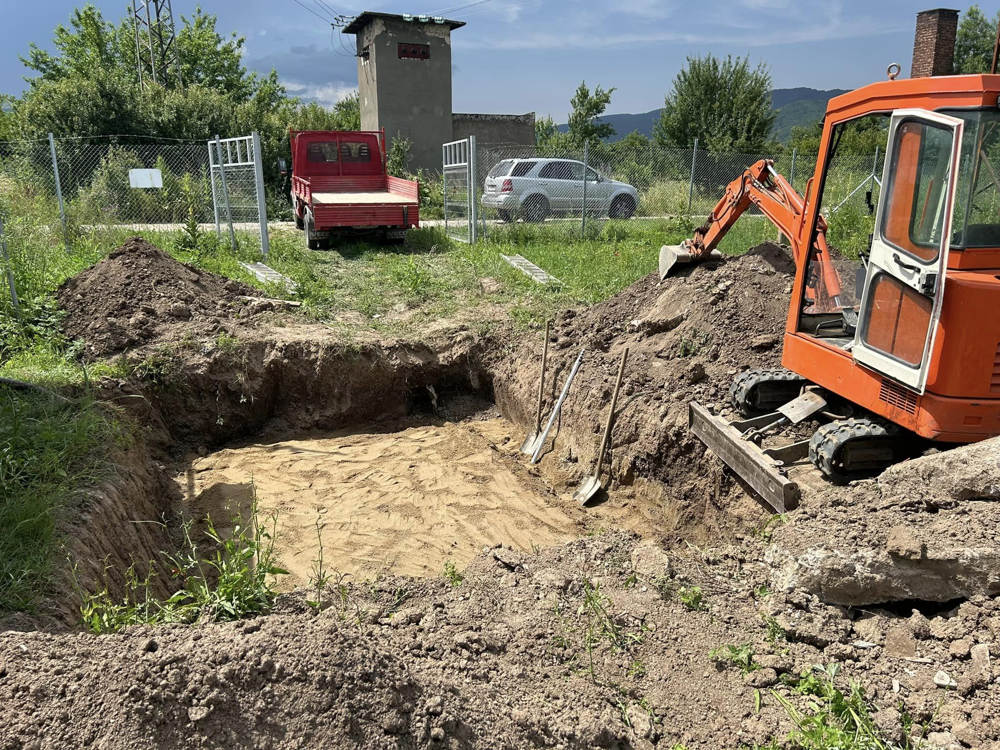
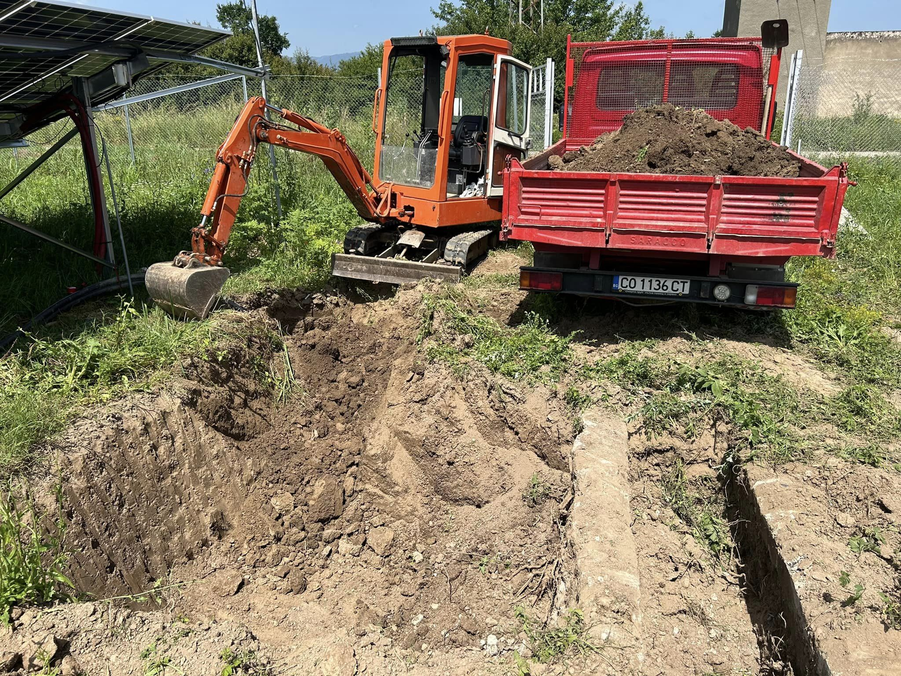
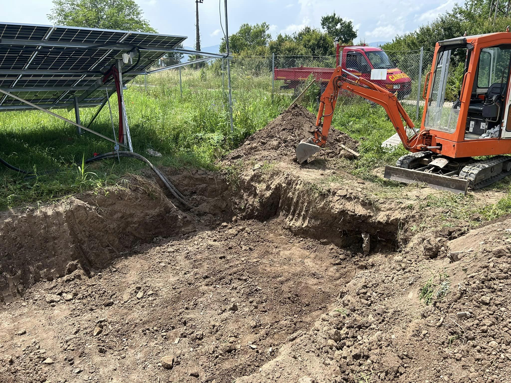
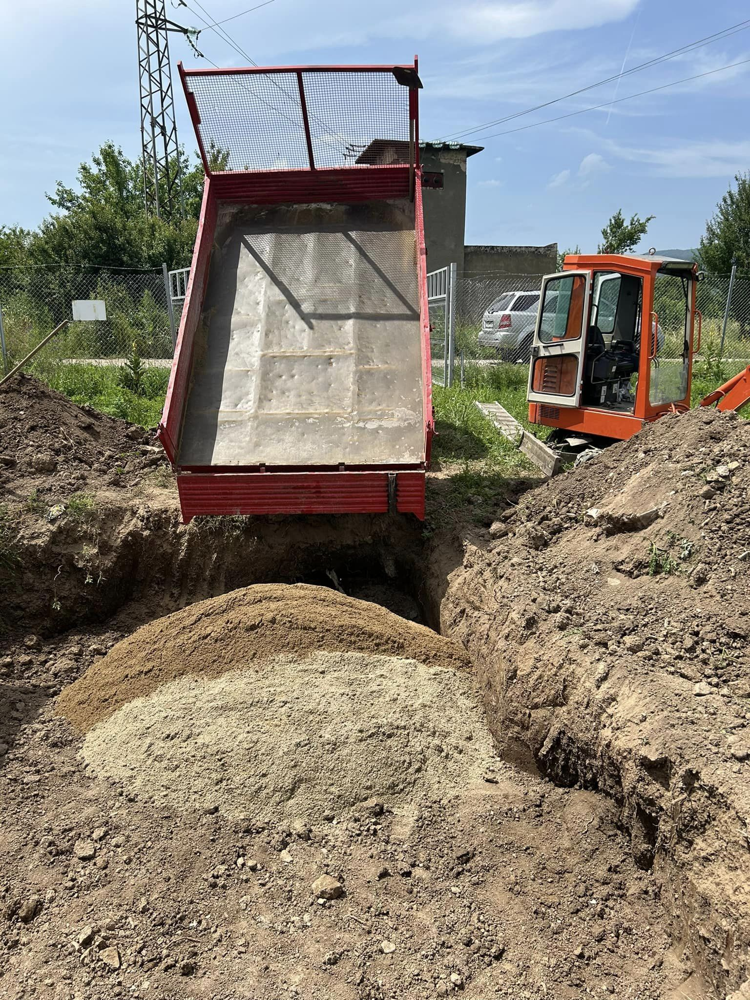