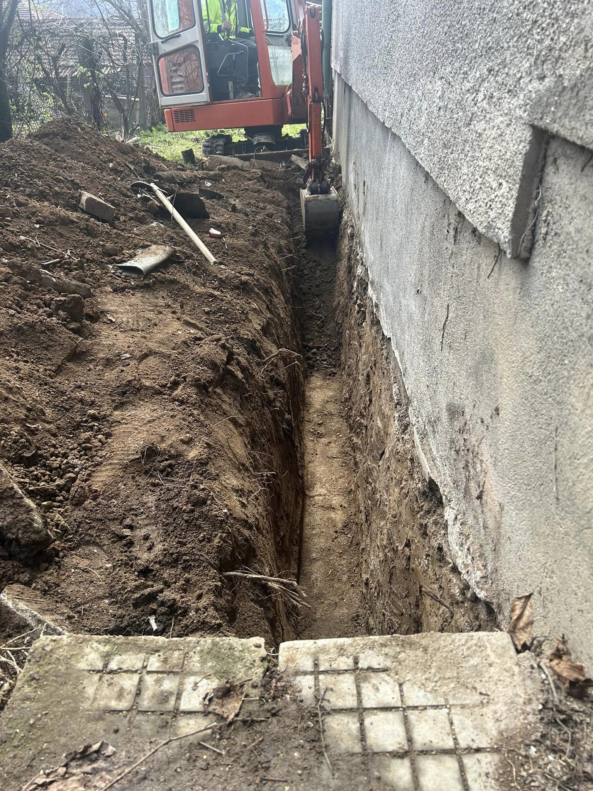
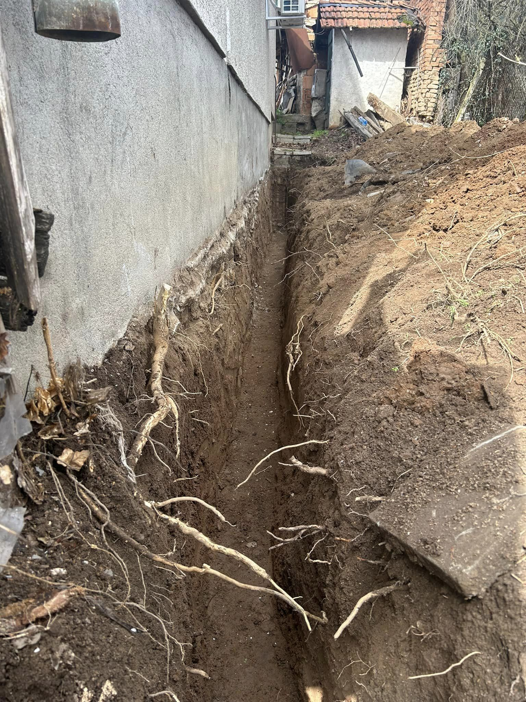
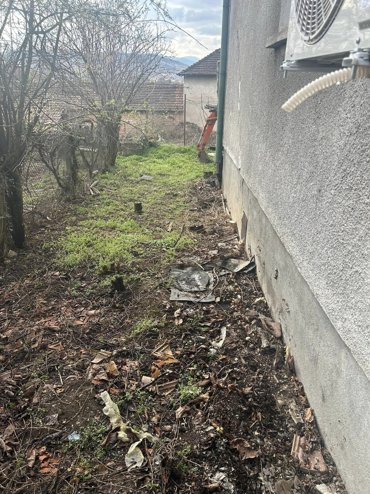
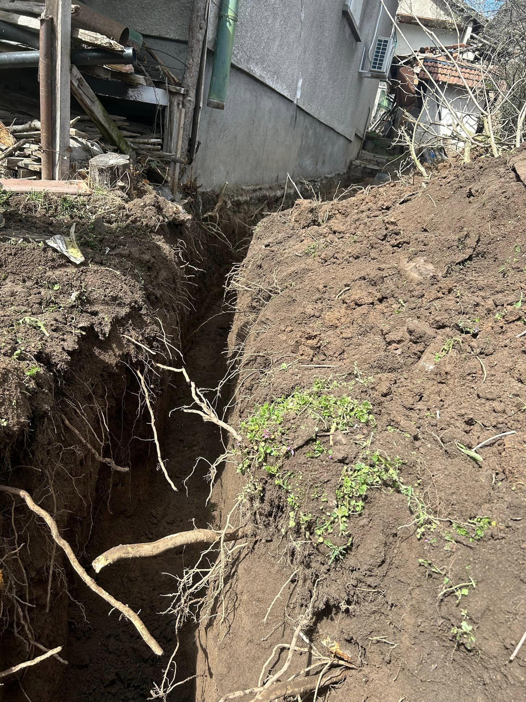
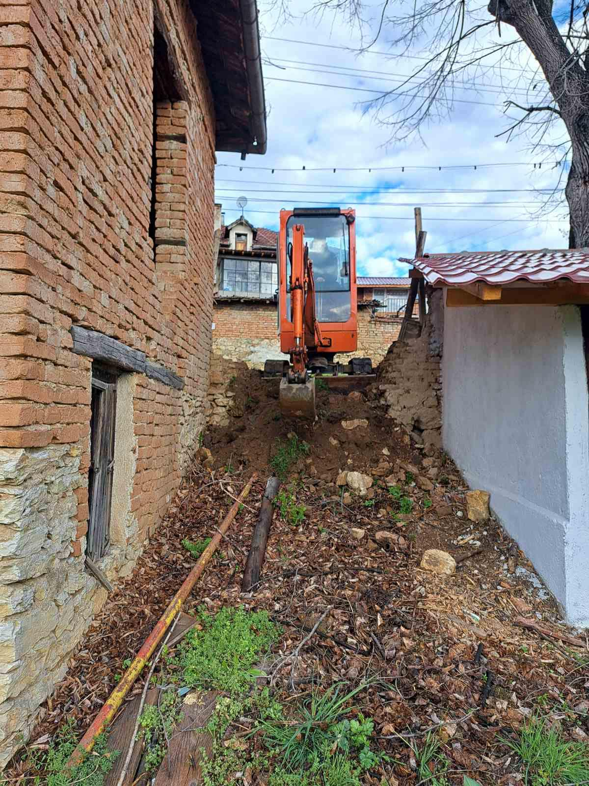
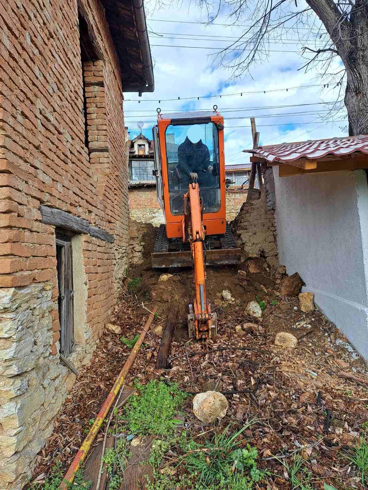
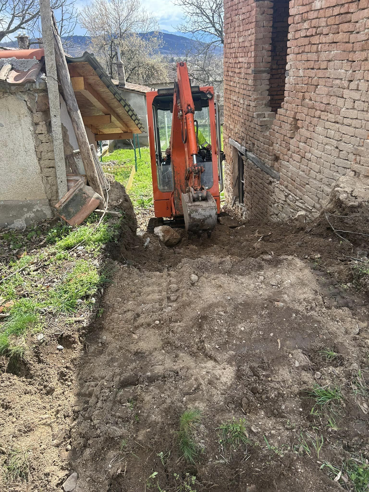
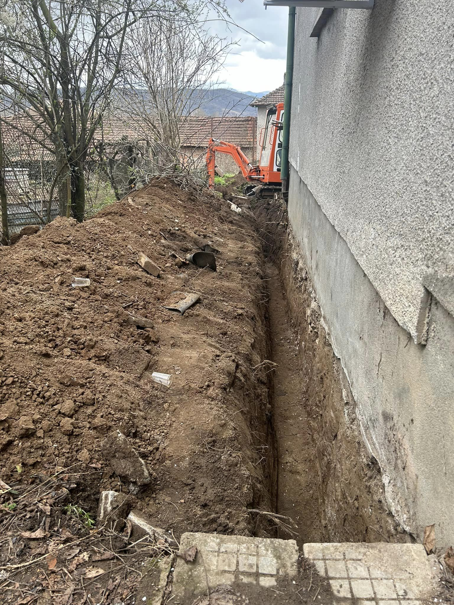

Изкопите за дренажи са ключова услуга за управление на дъждовната вода и предотвратяване на наводнения. Правилно проектираната дренажна система осигурява ефективно отвеждане на излишната вода, което е от съществено значение за защитата на вашия имот.

## Какво включва услугата:

- Оценка на терена и идентификация на проблемните зони 📊
- Изкопаване на канали за дренаж, съобразени с нуждите на вашия имот 🌍
- Полагане на дренажни тръби и филтриращи системи, които осигуряват дълготрайно решение ✅
- Тестове за ефективност на системата, преди финалното покритие 🌧️

Нашият екип от опитни специалисти е готов да ви помогне да създадете надеждна дренажна система, която да защити вашия имот от нежелани водни проблеми.

📞 **Свържете се с нас за оферта още днес!**

# Галерия от проект (Март, 2024):

