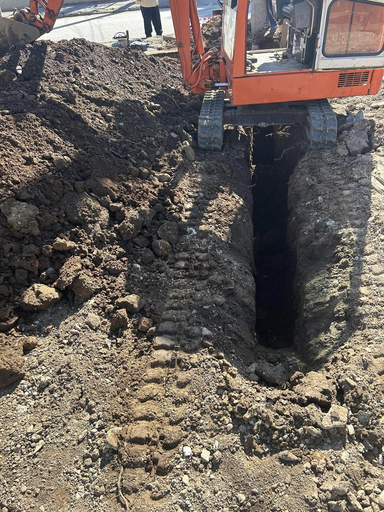
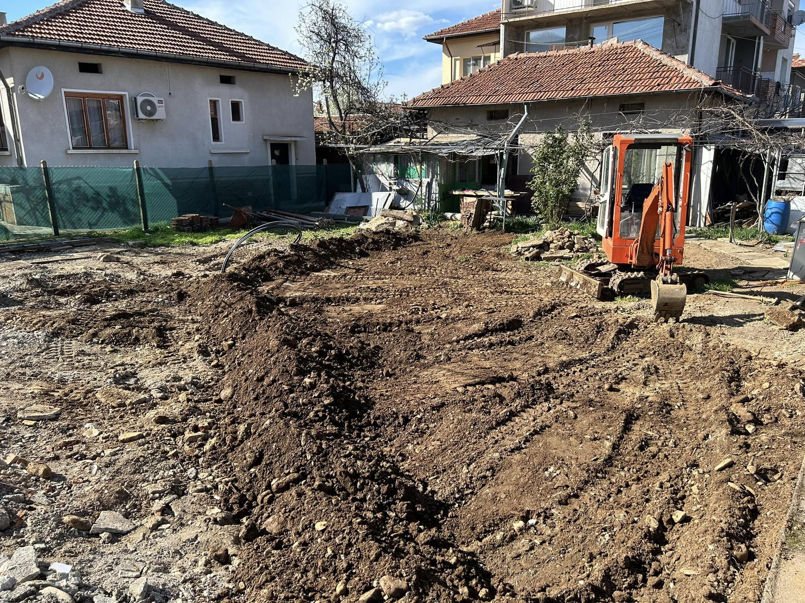
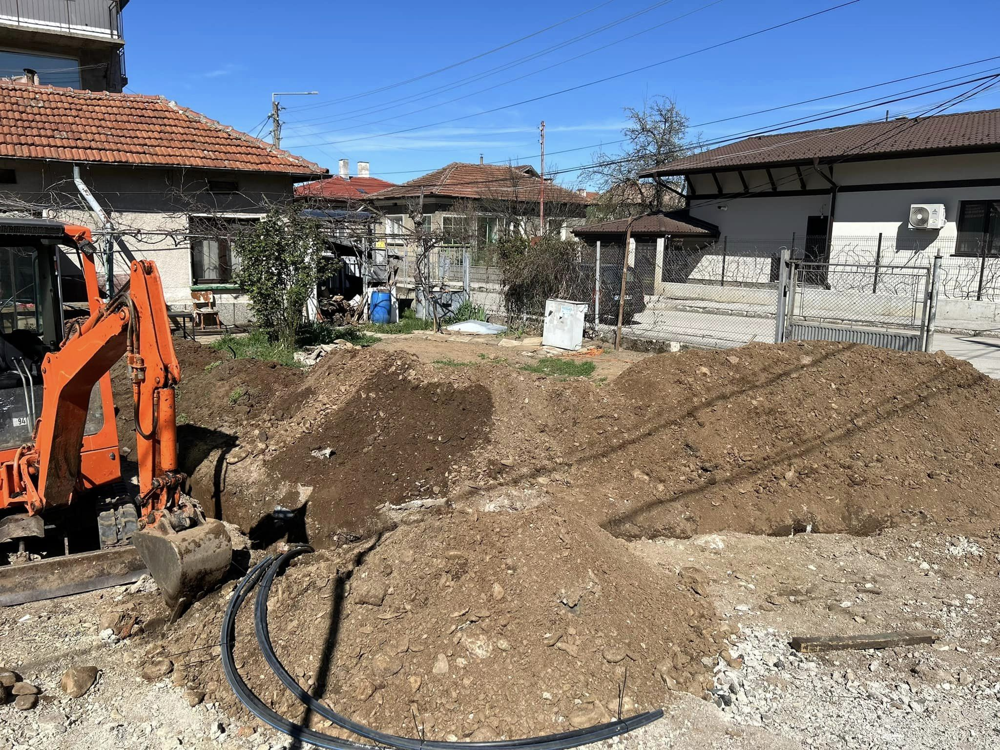
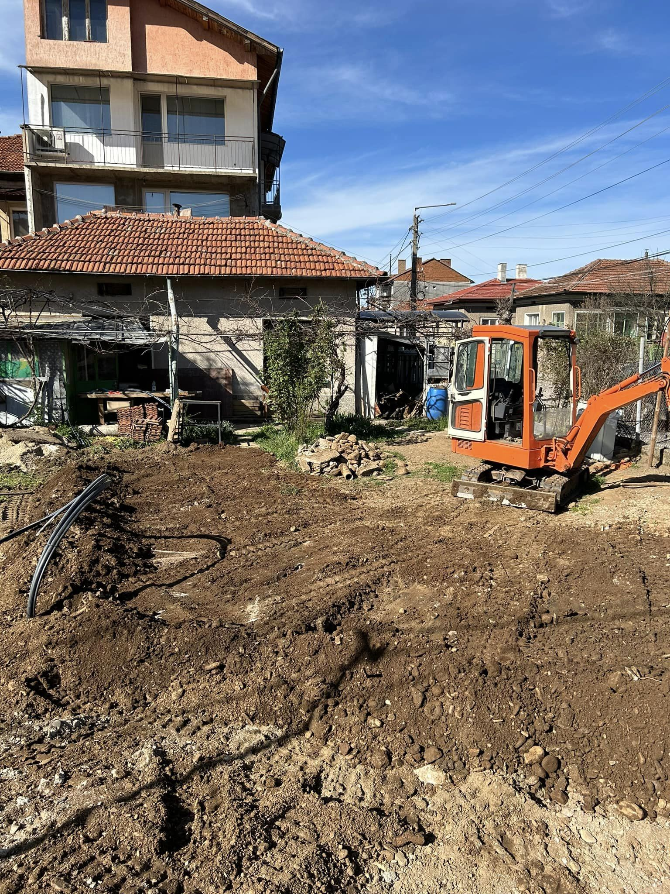
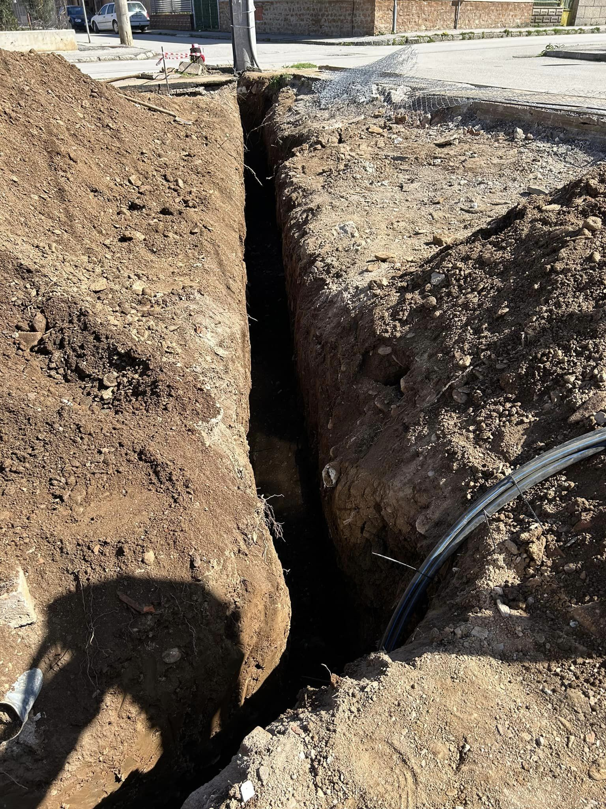
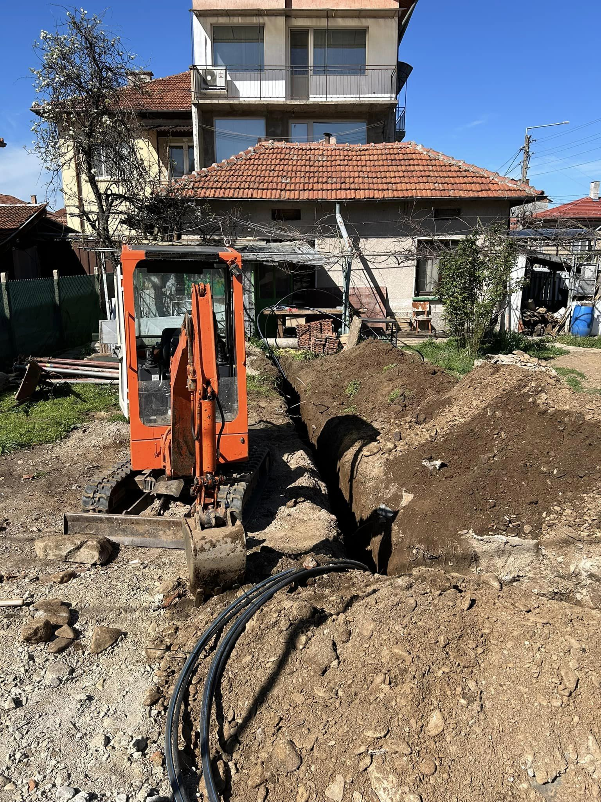

Изкопите за електрическа инсталация са важна част от всеки строителен проект, осигуряващи безопасно и ефективно полагане на електрическите кабели. Нашите услуги включват професионално изпълнение на изкопи, които да отговорят на специфичните нужди на вашата електрическа система.

## Какво включва услугата:

- Планиране и проектиране на изкопите в съответствие с изискванията на електрическата инсталация 📐
- Изкопаване на канали с необходимите размери и дълбочини, осигуряващи безопасност и дълготрайност 🔍
- Полагане на защитни тръби за кабелите, които предотвратяват повреди и осигуряват изолиране 💪
- Финален преглед и тест на изкопаните канали, за да се гарантира, че са готови за последващо полагане на кабели ✅

С нашия опитен екип ще се погрижим за всяка стъпка от процеса, осигурявайки безпроблемно изпълнение на вашите електрически инсталации.

📞 **Свържете се с нас за оферта още днес!**

# Галерия от проект (Март, 2024):

