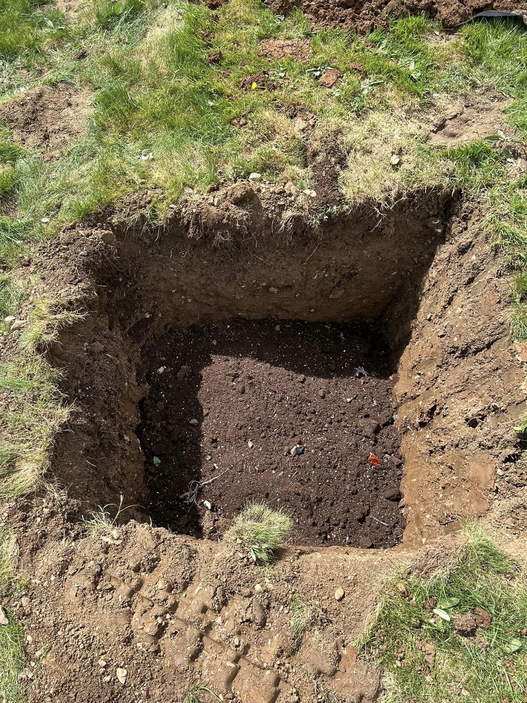
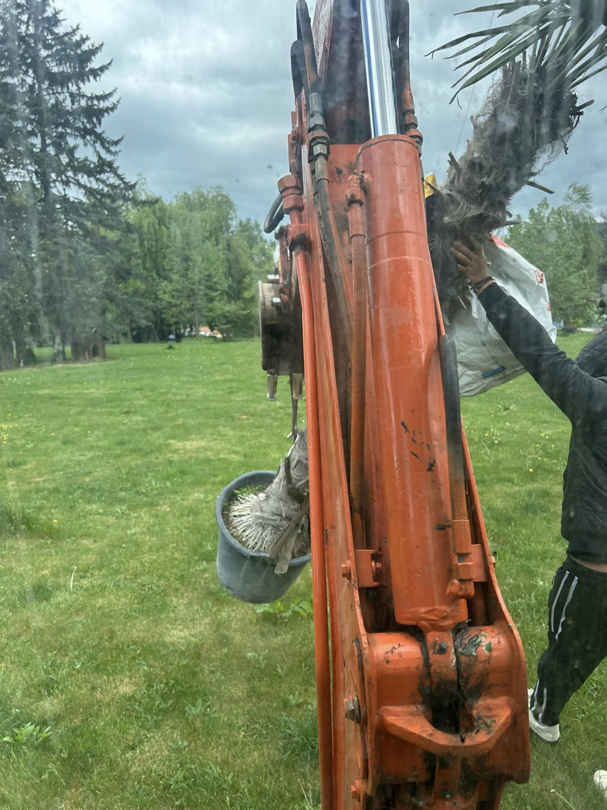
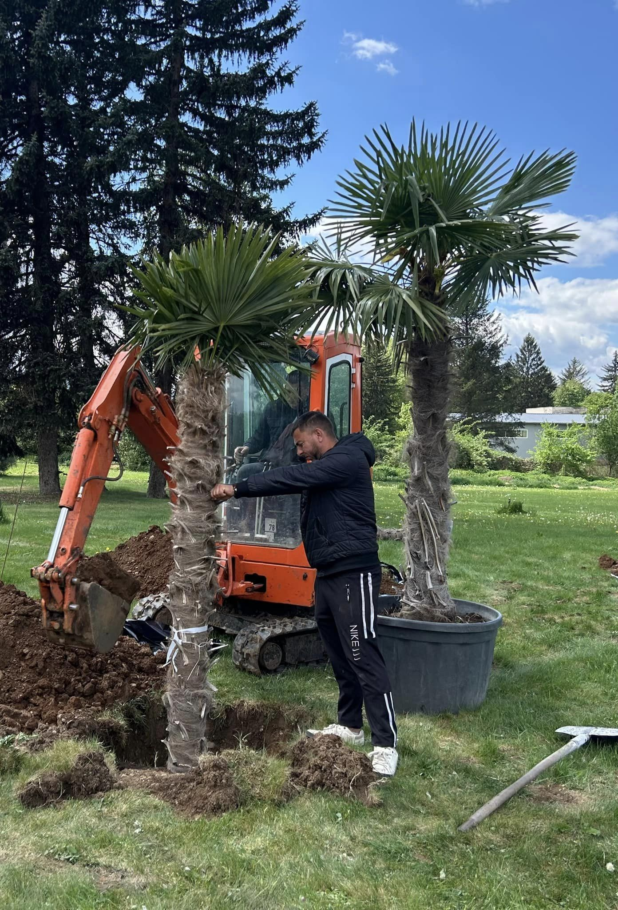
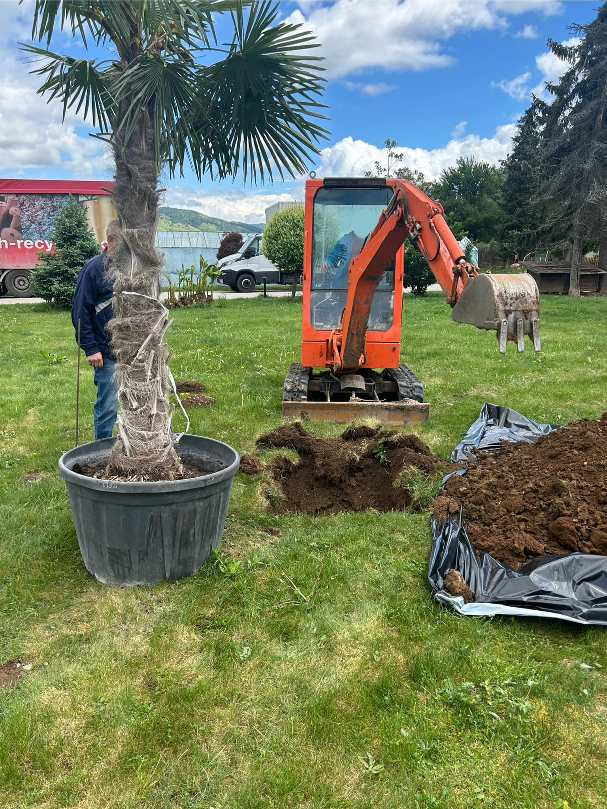
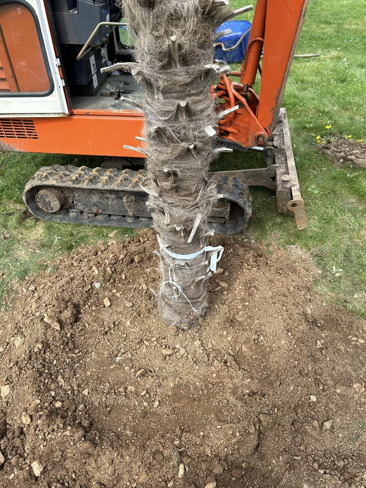
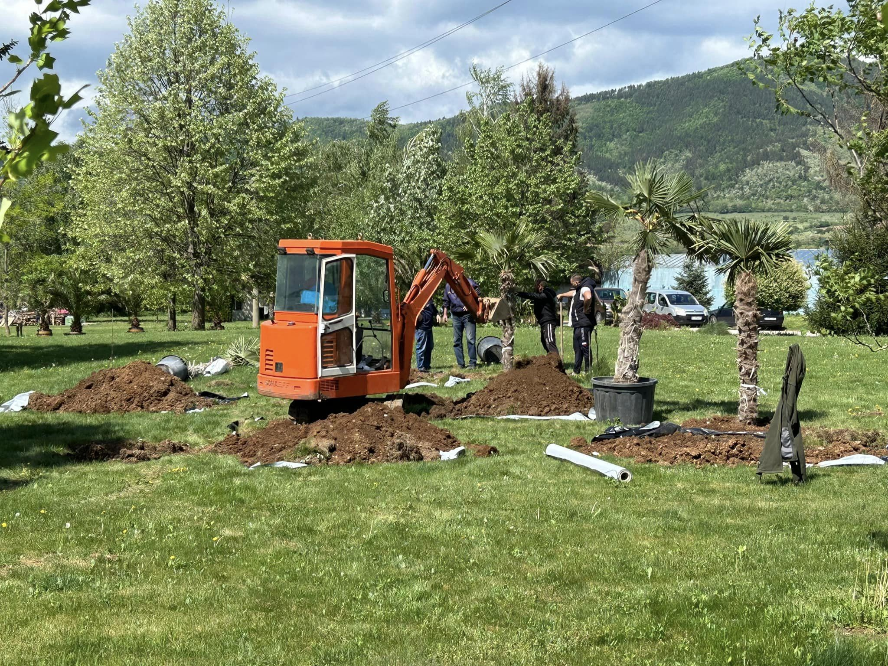
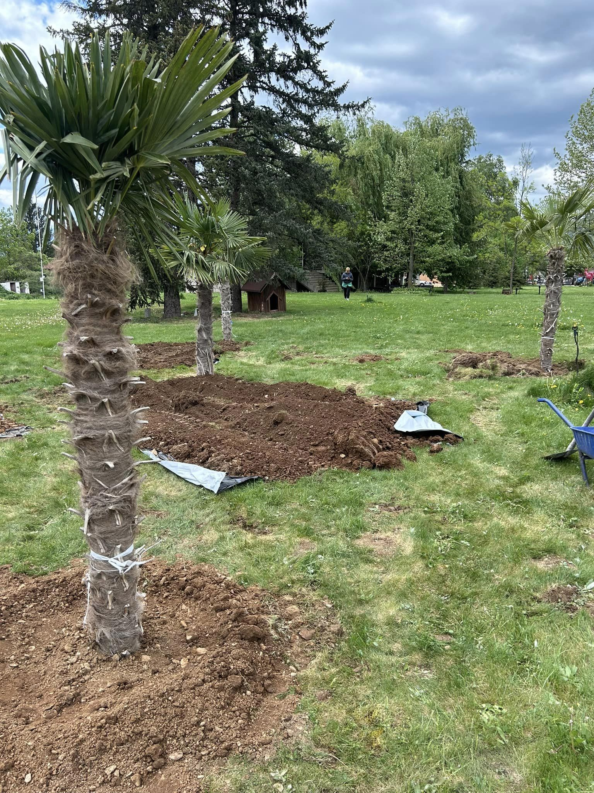
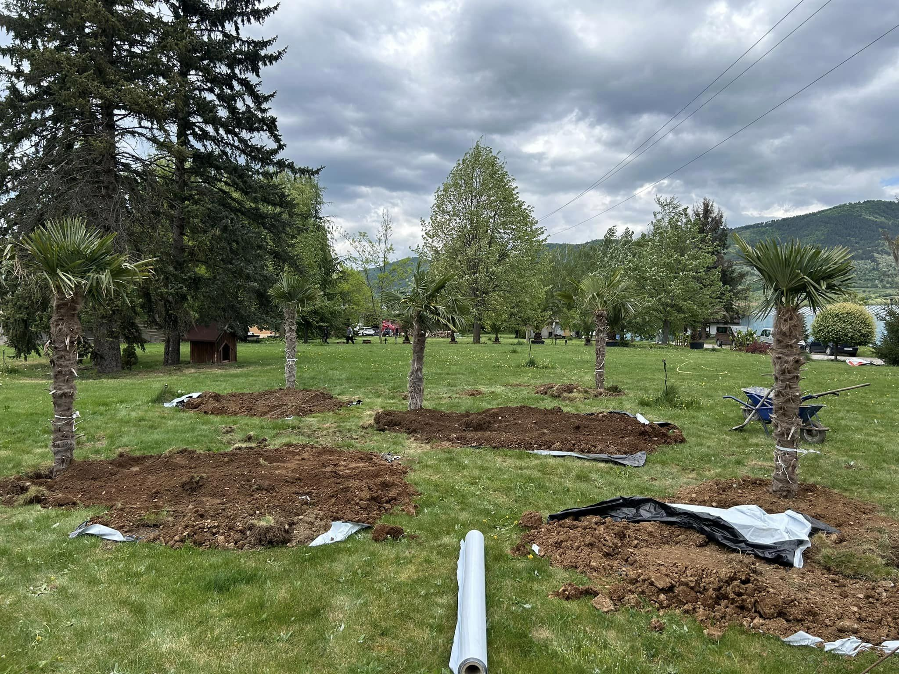
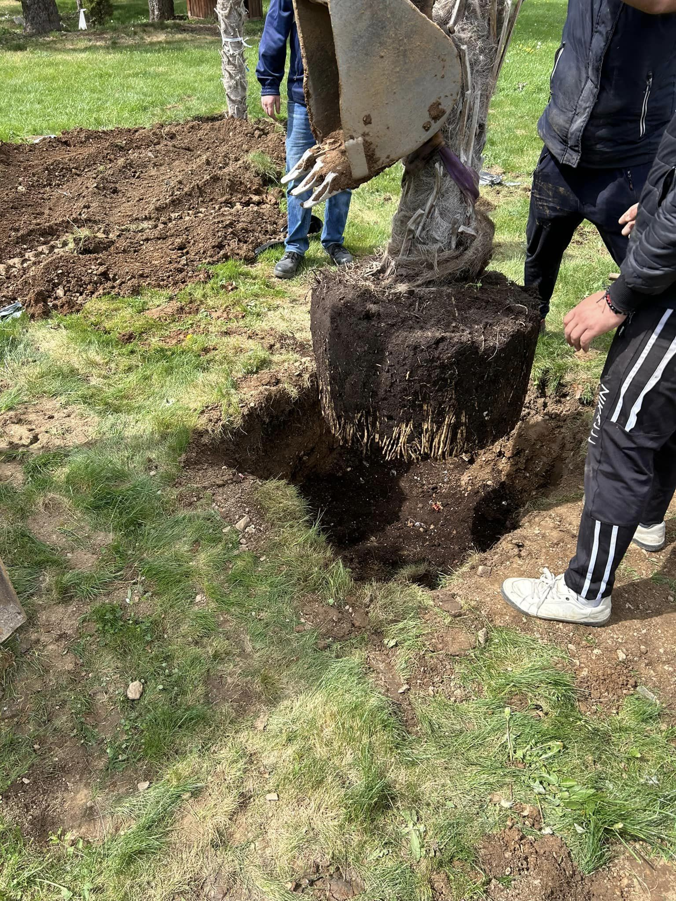

Изкопите за засаждане на овощни и екзотични дървета са важна стъпка в създаването на здрави и плодородни градини. Ние предлагаме професионални услуги, които осигуряват правилно подготвени места за засаждане, което е от съществено значение за растежа и развитието на дърветата.

## Какво включва услугата:

- **Оценка на терена:** Извършваме анализ на почвата и климатичните условия, за да определим най-подходящото място за вашите дървета 📊
- **Планиране на изкопите:** Определяме необходимите размери и дълбочини на изкопите, осигурявайки оптимални условия за кореновата система 🌱
- **Професионално изпълнение:** С нашата модерна техника и опитен екип, изкопаваме ями, които отговарят на специфичните нужди на овощните и екзотични дървета 🔧
- **Подготовка на почвата:** Преди засаждането, почвата се обработва и обогатява с необходимите хранителни вещества, за да се осигури идеален старт на растенията 🌾

Доверете се на нас за вашето озеленяване и създайте красива и плодородна градина, която ще радва вас и вашите близки!

📞 **Свържете се с нас за оферта още днес!**

# Галерия от проект (Април, 2024):

