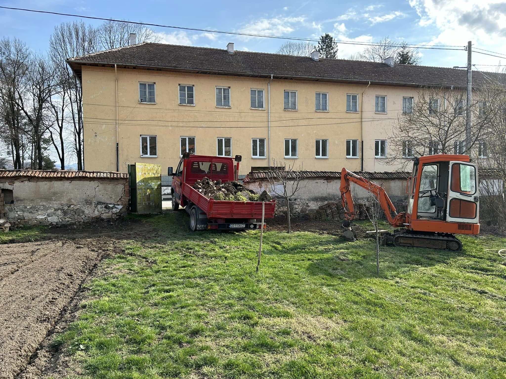
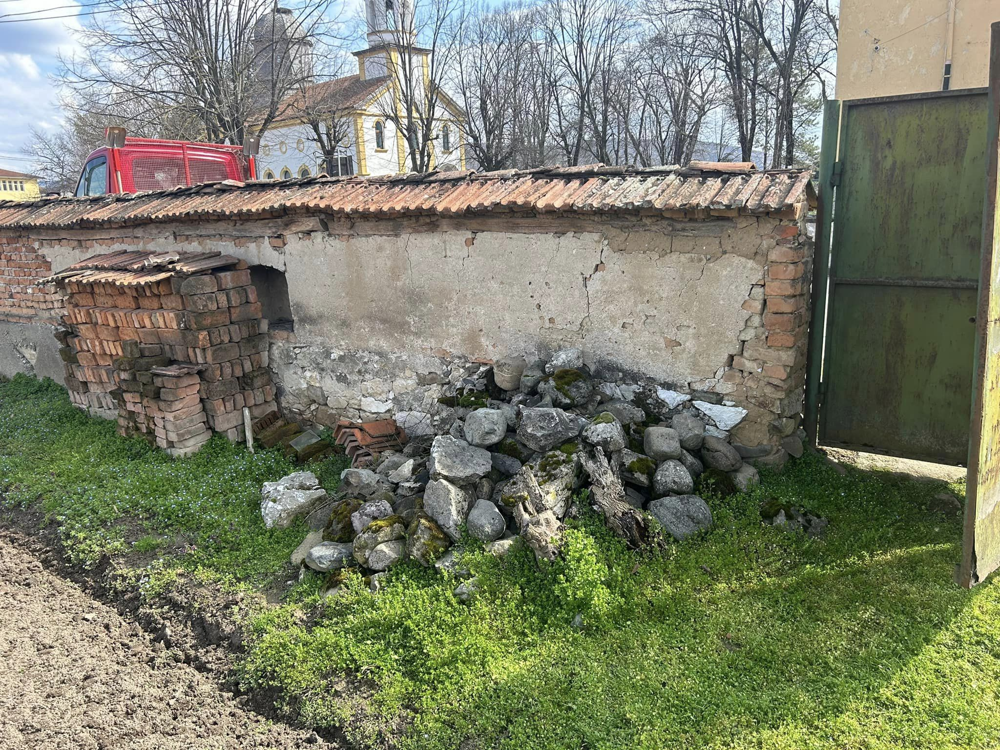
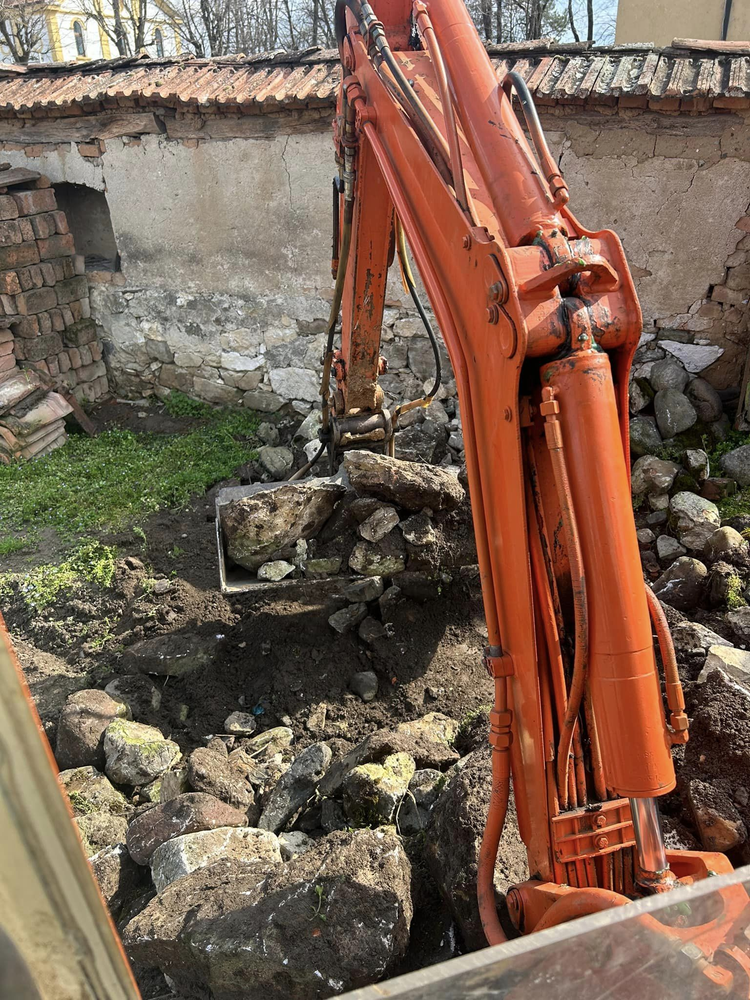
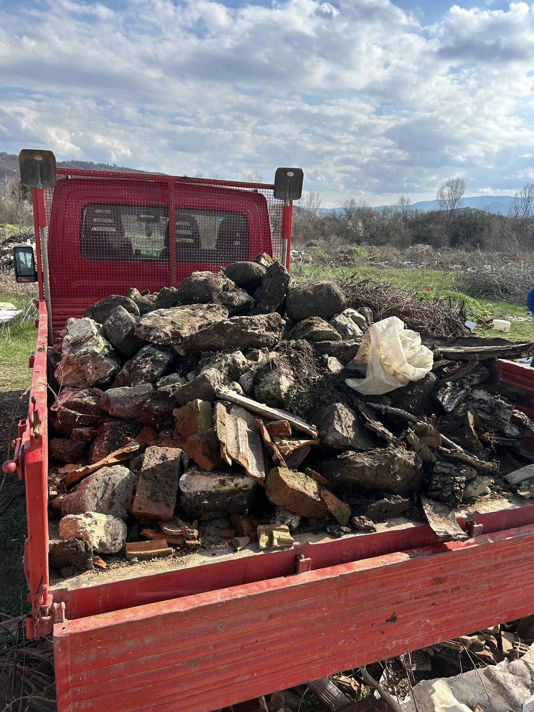
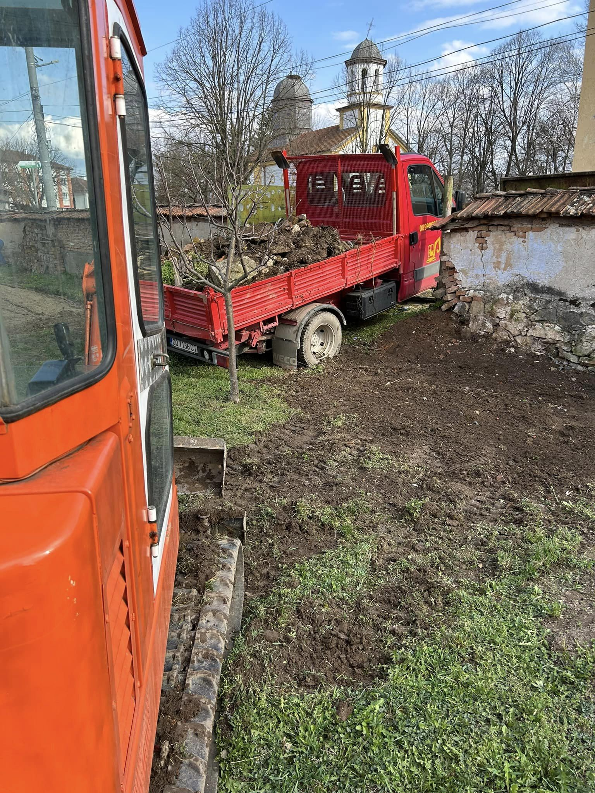
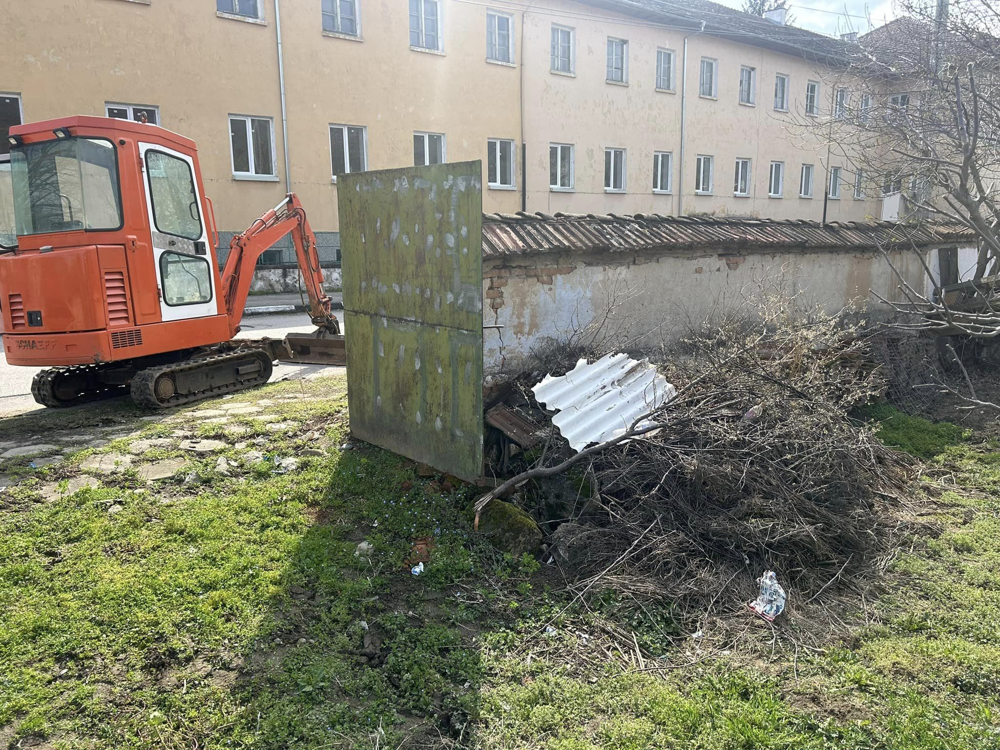

Извозването на камъни и клони е важна услуга, особено при подготовката на терени за строителство, озеленяване или почистване на градини. Ние предлагаме бързи и ефективни решения за премахване на ненужни материали, за да освободим пространството ви и да осигурим безопасна и чиста среда.

## Какво включва услугата:

- **Оценка на терена:** Нашите специалисти ще оценят обекта, за да определят количеството и типа на материалите, които трябва да бъдат извозени 📏
- **Професионално събиране:** Извършваме събиране на камъни, клони и всякакви отпадъци с помощта на специализирана техника, което гарантира бързина и безопасност 🏗️
- **Извозване до регистрирани депа:** Осигуряваме отговорно извозване на материалите до лицензирани депа, където ще бъдат обработени съгласно екологичните норми 🌱
- **Почистване на терена:** След извозването ще се погрижим да оставим терена чист и готов за следващите ви стъпки в проекта ✅

С нашата опитна команда и специализирана техника, можете да се доверите, че извозването на камъни и клони ще бъде извършено бързо и безпроблемно.

📞 **Свържете се с нас за оферта още днес!**

# Галерия от проект (Март, 2024):

