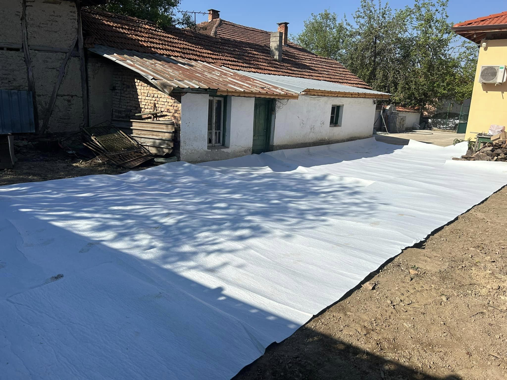

Полагането на геотекстил е ключова стъпка в строителството и ландшафтното оформление, която осигурява дългосрочна стабилност и защита на вашия проект. Нашата услуга включва професионално и качествено полагане на геотекстил, за да гарантира оптимална функционалност и устойчивост.

## Какво включва услугата:

- **Подбор на подходящ геотекстил:** Ние предлагаме консултации за избора на правилния тип геотекстил, съобразен с конкретните условия и нужди на вашия проект 📊
- **Подготовка на терена:** Осигуряваме подготовка на повърхността, за да гарантираме гладко и ефективно полагане на материала, което е основополагающее за успеха на целия проект 🔧
- **Професионално полагане:** С нашите квалифицирани специалисти и съвременна техника, ние гарантираме точно и надеждно полагане на геотекстила, което предотвратява ерозия, изтичане на вода и замърсяване 🚧
- **Контрол на качеството:** След приключване на работата извършваме проверки, за да осигурим, че полагането е изпълнено по най-високите стандарти и в съответствие с проектните изисквания ✅

С нас можете да сте сигурни, че вашият проект ще бъде завършен професионално и в срок.

📞 **Свържете се с нас за оферта още днес!**

# Галерия от проект (Юли, 2024):

