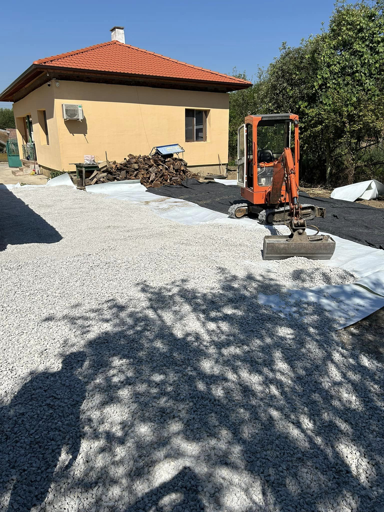
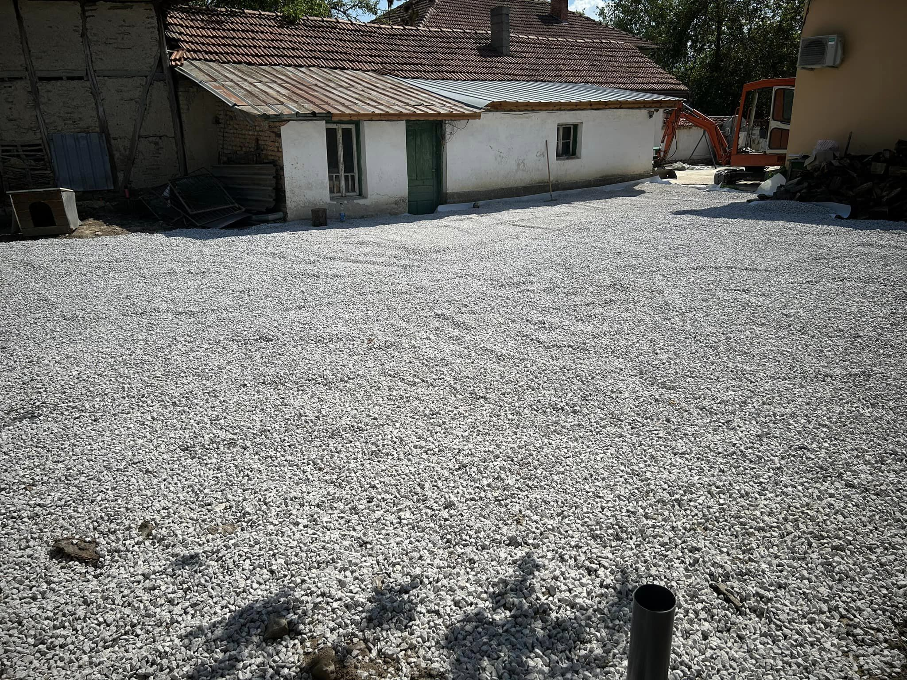
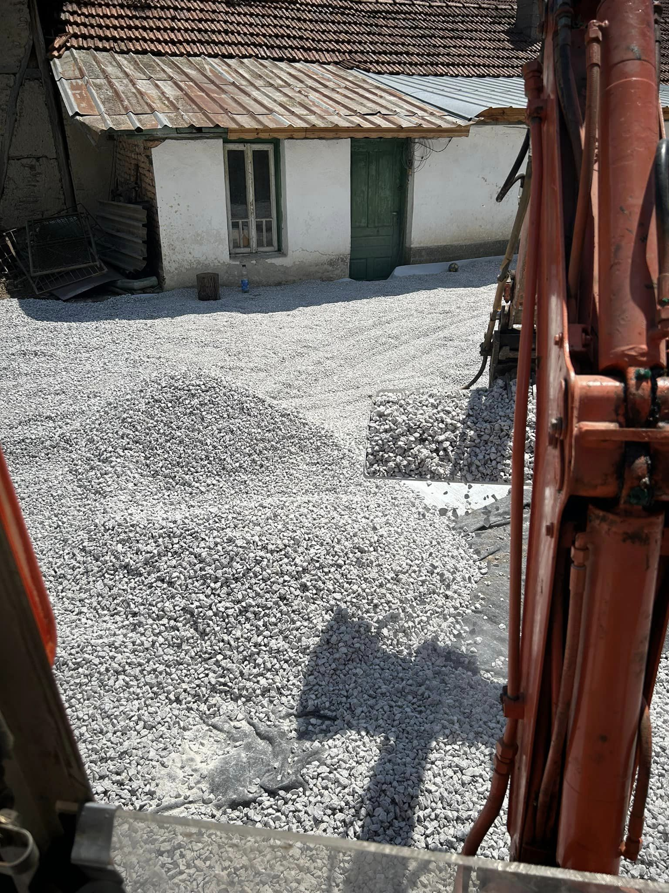
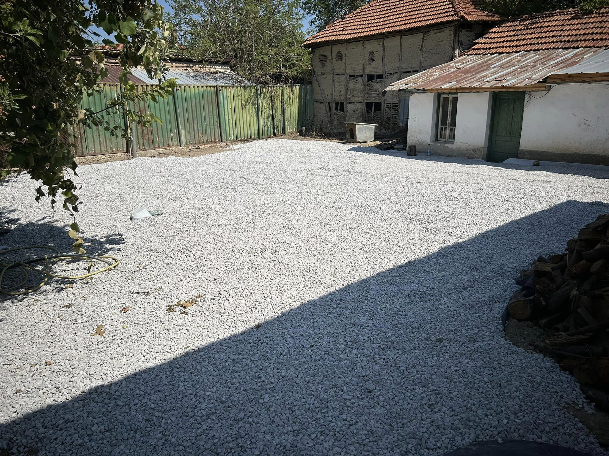

Разстилането на фракция е важен етап в подготовката на терен за строителство, ландшафтна архитектура или озеленяване. Ние предлагаме професионални услуги, които гарантират равномерно и ефективно разстилане на материалите, за да постигнете желаните резултати.

## Какво включва услугата:

- **Избор на подходяща фракция:** Ние ще ви помогнем да изберете най-подходящия материал в зависимост от вашите нужди и проект 📊
- **Доставка на фракция:** Осигуряваме бърза и безопасна доставка на фракцията до вашия обект, без да се налага да се притеснявате за логистиката 🚚
- **Професионално разстилане:** С нашата специализирана техника осигуряваме равномерно разстилане на фракцията, което предотвратява бъдещи проблеми и осигурява идеални условия за растеж и строителство 🔧
- **Контрол на качеството:** След завършване на работата, нашите специалисти извършват проверка, за да се уверят, че всичко е изпълнено по най-високите стандарти ✅

С нашия опитен екип ще се погрижим за всяка стъпка от процеса, така че вие да можете да се фокусирате върху вашия проект.

📞 **Свържете се с нас за оферта още днес!**

# Галерия от проект (Юли, 2024):

