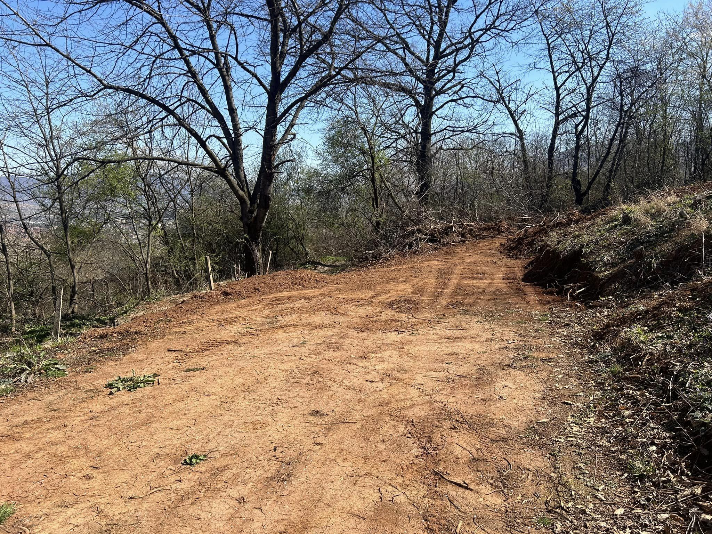
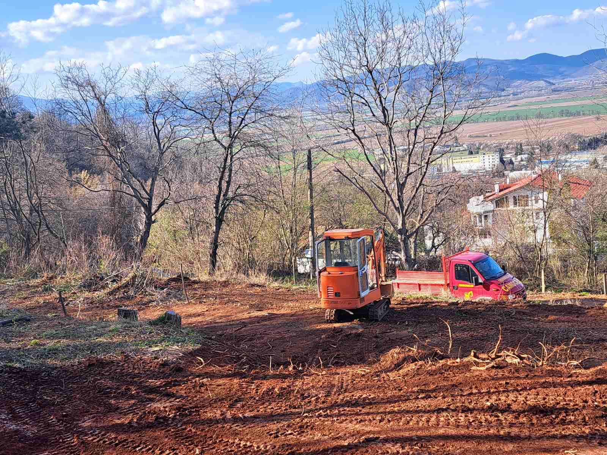
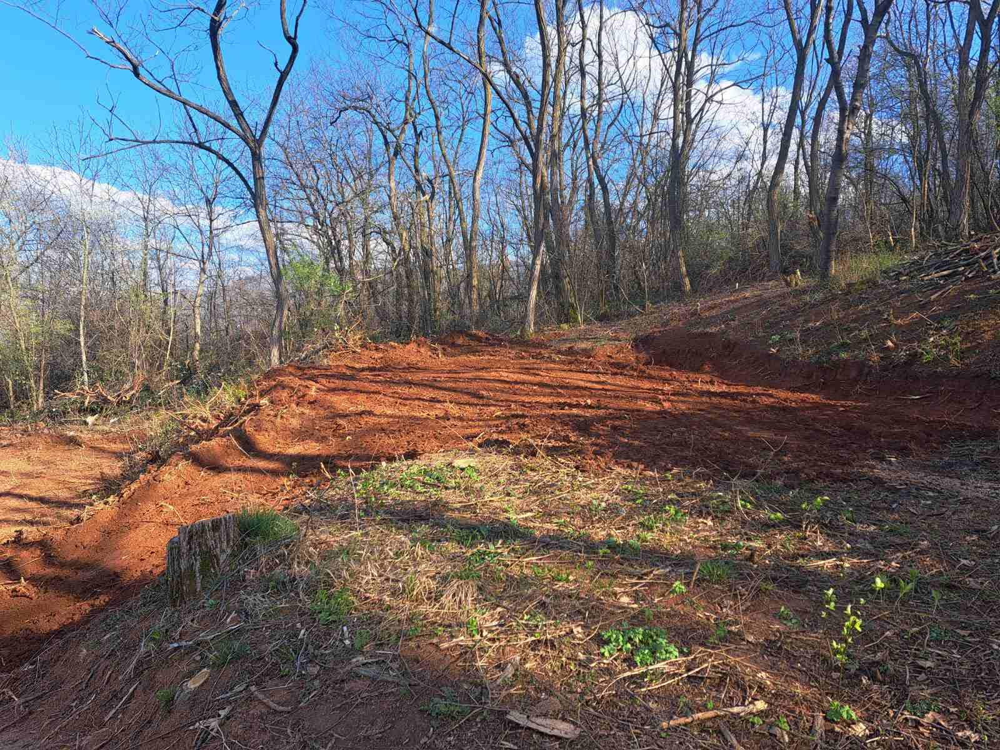
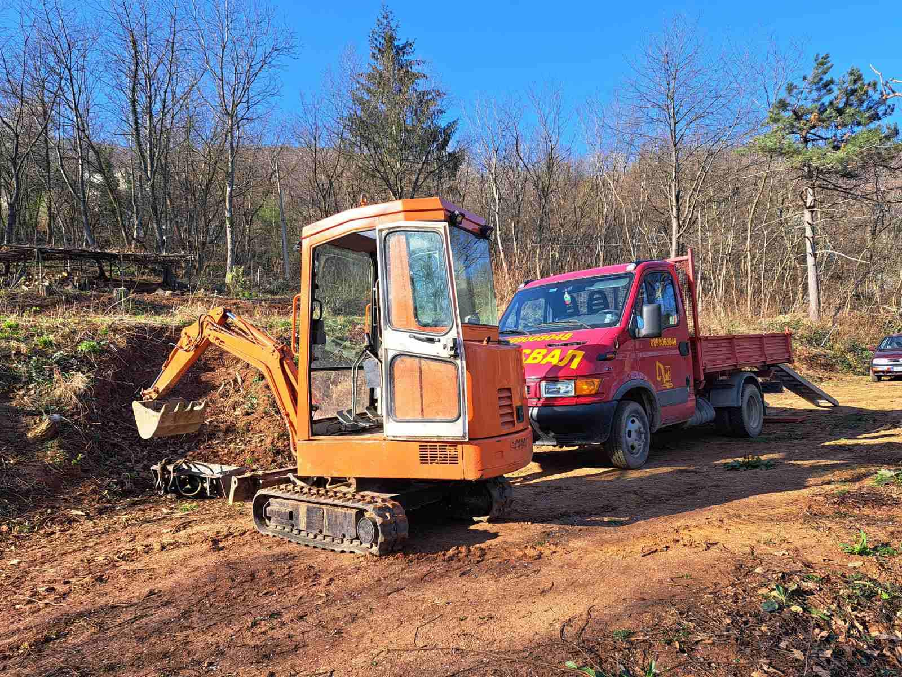
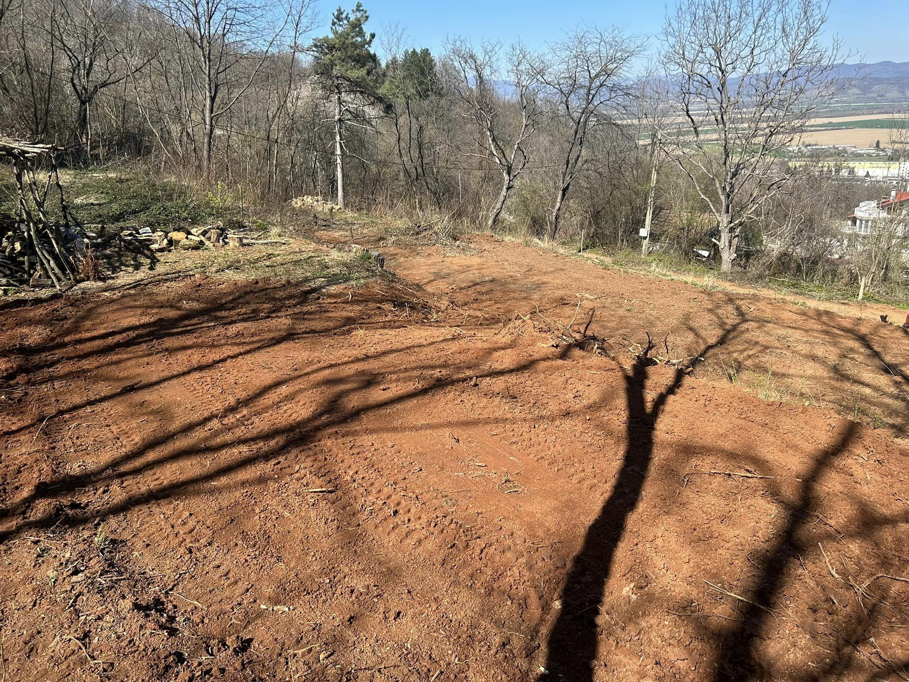
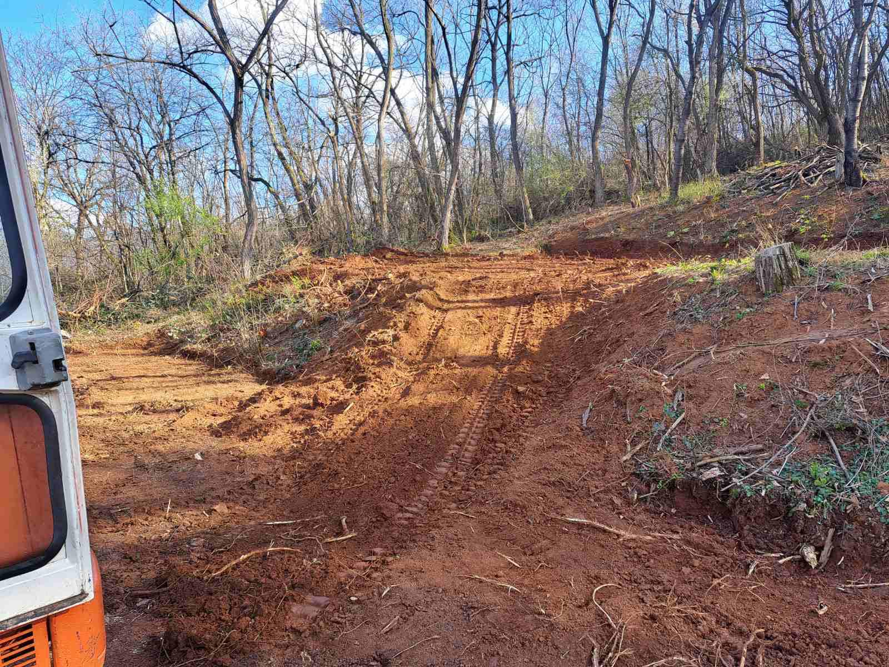
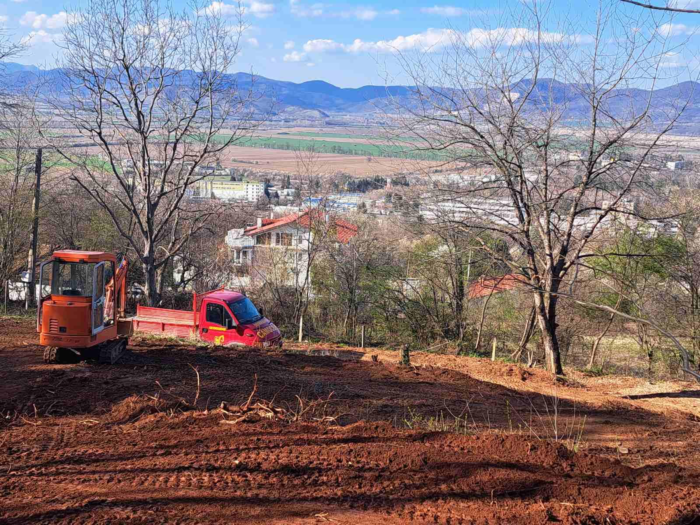
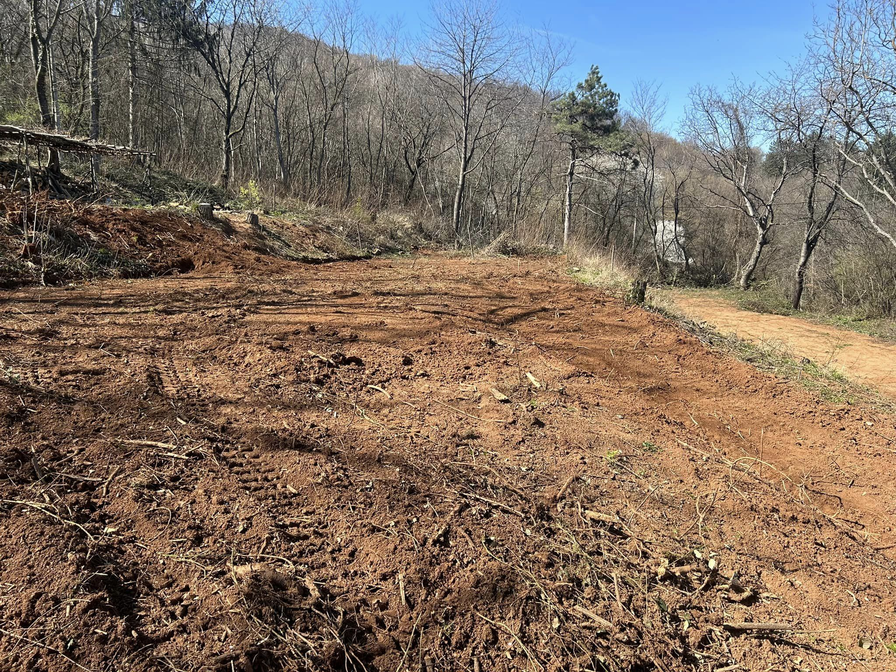
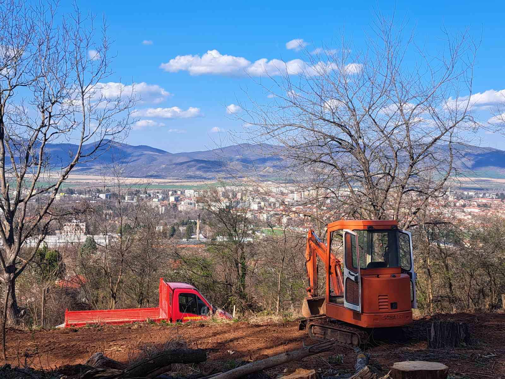

Терасирането и подравняването на имоти е важен процес, който подобрява естетиката и функционалността на вашия терен. Ние предлагаме професионални услуги, които ще трансформират вашето пространство в красиво и удобно място за живеене или работа.

## Какво включва услугата:

- Оценка на терена и планиране на терасирането в съответствие с природния ландшафт 📏
- Изкопаване и изграждане на тераси, осигуряващи стабилност и естетика 🌿
- Подравняване на повърхността, за да се предотвратят наводнения и да се улесни дренажът 💧
- Подбор на растения и озеленяване, за да добавите красота и стойност на имота 🌼

Нашият опитен екип е тук, за да ви помогне да създадете перфектното пространство, което да отразява вашите желания и нужди.

📞 **Свържете се с нас за оферта още днес!**

# Галерия от проект (Март, 2024):

